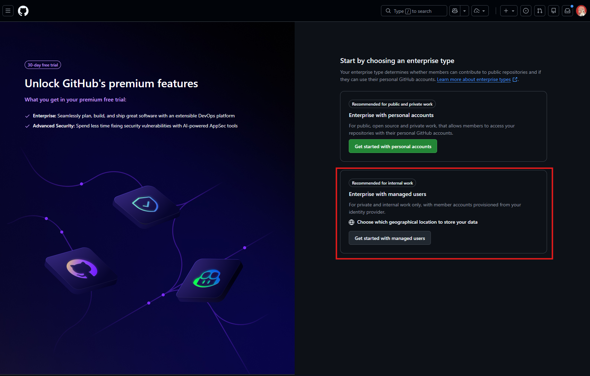
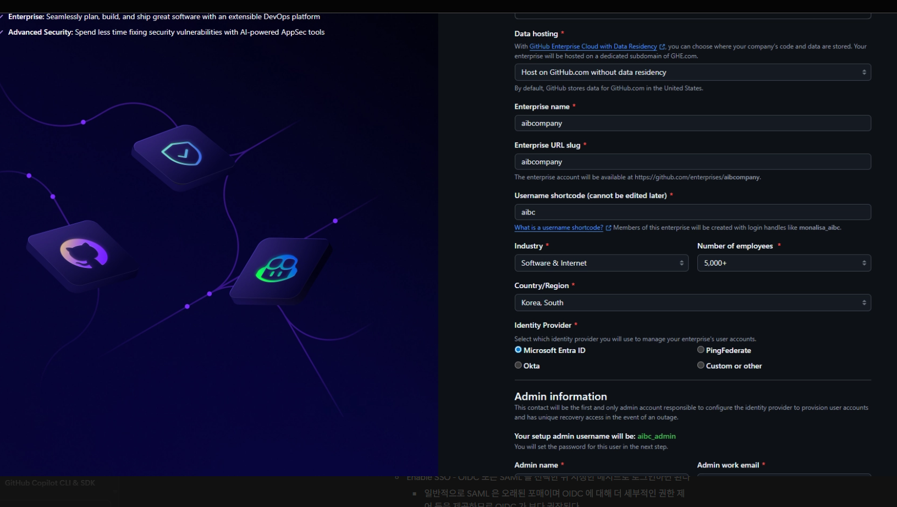
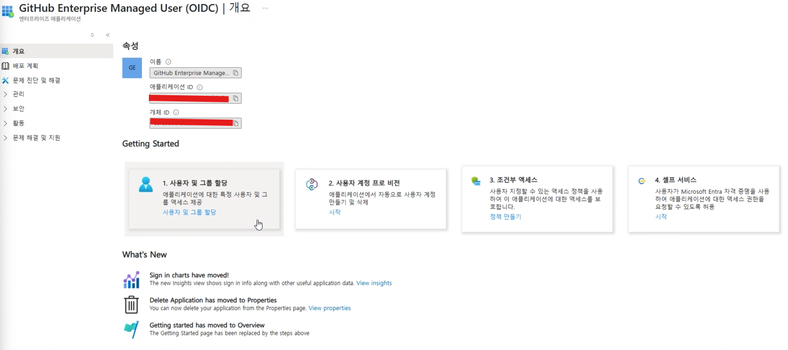

# 섹션 1: GitHub Enterprise 구성

## 📑 목차

- [GitHub Enterprise 소개](#github-enterprise-소개)
- [1.1 GitHub Enterprise 계층 구조 소개](#11-github-enterprise-계층-구조-소개)
- [1.2 Enterprise Account 설정](#12-enterprise-account-설정)
- [1.3 SSO 및 SCIM 프로비저닝](#13-sso-및-scim-프로비저닝)
- [1.4 Enterprise 정책 관리](#14-enterprise-정책-관리)
- [1.5 Audit Log 설정](#15-audit-log-설정)
- [1.6 체크리스트](#16-체크리스트)
- [참고 자료](#참고-자료)

---

## GitHub Enterprise 소개

GitHub Enterprise 란 GitHub 생태계 안에서 사용자들과 소스코드 저장소들을 관리하기 위한 논리적 Enterprise 계층구조입니다.

이를 통해 기업 전체의 소프트웨어 개발을 중앙에서 통합관리하여 보안 체계, 권한 관리, 감사 대응, 컴플라이언스 요건 만족, 조직 운영 등을 손쉽게 구성하실 수 있습니다.

최근에는 비개발자분들의 바이브 코딩(Vibe Coding)이 활성화됨에 따라 중요도가 더 높아지고 있으며, 이를 기반으로 AX 프로세스를 GitHub 생태계 중심으로 구성하고자하는 니즈가 많아지고 있습니다.

---

## 1.1 GitHub Enterprise 계층 구조 소개

GitHub 는 효과적인 조직 관리를 위해 계층 구조로 몇가지 개념들을 갖고있습니다.

```
Enterprise Account
├── Organization A (Engineering)
│   ├── Team: Backend
│   ├── Team: Frontend
│   └── Team: Platform
├── Organization B (Data)
│   ├── Team: ML
│   └── Team: Analytics
└── Organization C (Security)
    └── Team: AppSec
```

### Enterprise Account

- **역할**: 여러 Organization을 중앙에서 관리하는 최상위 계층
- **주요 기능**:
  - 통합 과금(Unified Billing)
  - Enterprise 수준 정책 적용
  - SAML SSO / SCIM 프로비저닝
  - Audit Log 스트리밍
  - GitHub Copilot, GitHub Advanced Security 등 제품 라이센스 중앙 관리

### Organization

- **역할**: 팀과 리포지토리를 묶는 단위
- **관리 포인트**: Organization 단위로 제품 활성화/비활성화, 멤버 관리, 리포지토리 정책 설정

### Team

- **역할**: Organization 내 접근 권한 그룹
- **모범 사례**: Team 기반으로 리포지토리 접근 권한 및 제품 시트를 할당하여 관리 효율성 극대화

---

## 1.2 Enterprise Account 설정

### Step 1: EMU / Non-EMU 체계 선택하기



- GitHub Sales 또는 [github.com/enterprise](https://github.com/enterprise) 를 통해 Enterprise 생성할 수 있습니다.
- GitHub Enterprise 는 Non-EMU 또는 EMU 로 생성할 수 있습니다. 각각의 차이점은 다음과 같습니다.

| 항목 | Non-EMU | EMU (Enterprise Managed Users) |
|------|---------|-------------------------------|
| **계정 생성** | 사용자가 직접 GitHub.com 계정 생성 | IdP(Entra ID 등)에서 계정을 프로비저닝 |
| **계정 소유권** | 사용자 개인이 소유 | Enterprise가 소유·관리 |
| **사용자명 형식** | 자유 설정 (예: `john-doe`) | `{IdP핸들}_{shortcode}` 형식 (예: `john-doe_contoso`) |
| **외부 기여** | ✅ Enterprise 외부 리포지토리에 기여 가능 | ❌ Enterprise 범위 내 리포지토리만 접근 가능 |
| **인증 방식** | SAML SSO 연동 (기존 계정에 SSO 링크) | OIDC 또는 SAML (IdP가 계정 라이프사이클 전체 관리) |
| **SCIM 프로비저닝** | 선택 사항 | 필수 (IdP 그룹 → Team 자동 매핑) |
| **IP Allow List** | Organization 수준에서 설정 | Enterprise 수준에서 중앙 관리 가능 |
| **IdP 조건부 접근(CAP)** | ❌ 미지원 | ✅ OIDC 사용 시 IdP의 Conditional Access Policy 적용 |
| **계정 비활성화** | SAML 세션 만료 시에도 GitHub.com 접근 가능 | IdP에서 비활성화 시 GitHub 계정 즉시 정지 |
| **PAT/SSH 키 관리** | 사용자 자율 관리 | Enterprise 정책으로 생성·만료 제어 가능 |
| **Fork 정책** | 외부 리포지토리 포크 가능 | Enterprise 내부 리포지토리만 포크 가능 |
| **권장 대상** | OSS 기여가 필요한 조직, 기존 계정 유지 필요 시 | 보안·컴플라이언스 요구가 높은 엔터프라이즈 조직 |

- 실제 엔터프라이즈 환경에서는 EMU 로 구성을 권장드립니다. IP Allow List 와 같은 보안 관리 구성 등에 운영 시 어려움을 겪으실 수 있으며, 계정 체계가 복잡해지실 수 있습니다.
(Non-EMU 환경에서 EMU 환경으로 One-Click 이전은 어려우며 별도 마이그레이션이 필요할 수 있습니다.)
- 본 워크샵에서는 EMU 환경 기준으로 설명합니다.

### Step 2: GitHub Enterprise 구성하기



- 적합한 호스팅 옵션과 Enterprise 이름을 입력해서 Enterprise 를 시작합니다. GitHub Enterprise Cloud with Data Residency 옵션은 26년 8월 기준 한국 리전에서 지원되지는 않습니다. Host on GitHub.com without Data Residency 옵션을 권장합니다.
- Enterprise Slug 는 Enterprise 의 ID 와 같은 역할로 사용됩니다.
- Short Name 구성에 유의합니다. Short Name 은 변경할 수 없으며 계정 체계의 마지막에 붙는 Unique Identifier 로 작용합니다.
- Identity Provider 로는 Microsoft Entra ID 기준으로 통합하실 수 있으며, Okta 등 유명한 IDP 사업자를 연동하실 수도 있습니다. 환경에 적합한 IDP 를 설정합니다. (본 워크샵은 Microsoft Entra ID 기준으로 설명합니다)
- Admin 설정은 초기 환경 설정을 위한 비밀번호 발급을 위한 메일 주소입니다. 
- 모든 정보를 입력하고 Create Enterprise 후 기다리면 Password 설정 이메일이 발송됩니다. Set your Password 버튼에서 링크를 복사한 뒤 시크릿모드 (In Private Mode) 브라우저에서 주소를 입력합니다. (이렇게 하는 이유는 가끔 GitHub.com 계정과 세션이 꼬이는 현상이 발생할 수 있기 때문입니다.)

엔터프라이즈 어카운트 설정을 위해서는 다음 권한들이 필요합니다. (Microsoft Entra ID 인증 기준)

```
Enterprise Roles:
├── Enterprise Owner    — 전체 관리 (정책, 과금, Organization 관리)
├── Enterprise Member   — Enterprise 내 Organization 멤버
└── Billing Manager     — 과금 정보 접근
```

---

## 1.3 SSO 및 SCIM 프로비저닝

### SSO 설정

- Generate SCIM Token 버튼을 눌러서 EMU GHCP 의 토큰을 생성합니다. 
- 인증을 위해서는 OIDC 기반 Single Sign On 또는 SAML 기반 Single Sign On 을 구성하실 수 있습니다.

| 항목 | OIDC 기반 인증 | SAML 기반 인증 |
|------|---------------|---------------|
| **프로토콜** | OpenID Connect (OAuth 2.0 확장) | SAML 2.0 |
| **조건부 접근 정책 (CAP)** | ✅ IdP의 Conditional Access Policy 적용 가능 (IP 제한, 디바이스 컴플라이언스, MFA 강제 등) | ❌ IdP의 CAP를 GitHub 세션에 반영 불가 |
| **세션 관리** | IdP 세션 정책 실시간 반영 (세션 만료 시 즉시 재인증 요구) | SAML 세션 수명 고정, IdP 세션 변경이 즉시 반영되지 않음 |
| **토큰 갱신** | Access Token 자동 갱신 (Refresh Token 기반) | 인증서 기반, 수동 갱신 필요 |
| **설정 복잡도** | 상대적으로 간단 (Entra ID 기본 지원) | 인증서 교환, 엔드포인트 수동 설정 필요 |
| **지원 IdP** | Microsoft Entra ID (권장), Okta, PingFederate | Microsoft Entra ID, Okta, OneLogin, PingFederate 등 |
| **PAT/SSH 키 정책** | CAP 위반 시 PAT/SSH 키 사용 자동 차단 | PAT/SSH 키에 CAP 적용 불가 |
| **IP 기반 제한** | IdP CAP에서 IP Allow List 통합 관리 | GitHub Enterprise 설정에서 별도 관리 |
| **권장 환경** | ✅ **EMU 환경에서 권장** — 보안 정책 통합 관리에 유리 | 레거시 IdP 환경 또는 OIDC 미지원 IdP 사용 시 |

> 💡 **권장**: EMU 환경에서는 **OIDC 기반 인증**을 사용하는 것을 권장합니다. IdP의 조건부 접근 정책(Conditional Access Policy)을 GitHub 세션에 그대로 적용할 수 있어, 별도의 IP Allow List 관리 없이도 네트워크·디바이스 기반 접근 제어가 가능합니다.

- SCIM을 설정하면 IdP의 그룹/사용자 변경이 GitHub에 자동 반영됩니다.

```
IdP 그룹 변경
    │
    ▼ (SCIM 자동 동기화)
GitHub Enterprise
    ├── 사용자 생성/비활성화
    ├── Team 멤버십 업데이트
    └── Organization 멤버십 업데이트
```

**Azure AD(Entra ID) 연동 :**



- Azure Portal → **Enterprise Applications** → **GitHub Enterprise Cloud - Enterprise Account** 를 선택합니다.
- 왼쪽 메뉴의 **Provisioning** 설정을 **Automatic** 으로 선택하고 저장합니다.
- Tenant URL 을 적절하게 입력합니다 (Enterprise 설정): `https://api.github.com/scim/v2/enterprises/{enterprise}`
- Secret Token: GitHub Enterprise에서 SCIM Generate 를 통해 생성한 PAT (admin:enterprise scope) 값입니다.

- 연결 테스트가 정상 확인되면 연결을 저장합니다.

- Provision 을 자동 설정하면 40분 주기로 계정이 자동 연동됩니다. 변경사항이 있는 경우 수동으로 직접 연동도 가능합니다.

---

## 1.4 Enterprise 정책 관리

Enterprise 수준에서 설정한 정책은 모든 하위 Organization에 적용됩니다.
GitHub Copilot 과 관련된 항목들의 경우 각 02번 - 03번 섹션에서 좀 더 자세히 다루겠습니다. :) 

### 주요 정책 항목

| 정책 카테고리 | 설명 | 설정 경로 |
|--------------|------|-----------|
| **Repository policies** | 리포지토리 가시성, 포크 정책 | Enterprise → Policies → Repositories |
| **Member privileges** | 멤버 기본 권한, 외부 협업자 | Enterprise → Policies → Member privileges |
| **Authentication** | SSO 필수 여부, 2FA 정책 | Enterprise → Settings → Authentication |
| **GitHub Actions** | Actions 사용 범위, Runner 정책 | Enterprise → Policies → Actions |
| **GitHub Copilot** | Copilot 활성화, 기능별 정책 | Enterprise → Policies → Copilot |
| **Code security** | Advanced Security, Secret Scanning | Enterprise → Policies → Code security |

### 정책 적용 방식

```
Enterprise 정책 설정 옵션:

1. "No policy" (정책 없음)
   → Organization이 자체적으로 결정

2. "Enabled" / "Disabled" (강제)
   → 모든 Organization에 동일 설정 적용
   → Organization이 재정의 불가
```

---

## 1.5 Audit Log 설정

### Enterprise Audit Log

Enterprise의 모든 관리 활동을 추적합니다. Audit Log 는 주기적으로 Export 해서 관리하실 수도 있습니다.

```bash
# REST API로 Audit Log 조회
curl -s -H "Authorization: Bearer $GITHUB_TOKEN" \
  -H "Accept: application/vnd.github+json" \
  "https://api.github.com/enterprises/{enterprise}/audit-log?phrase=action:org" \
  | jq '.[] | {action, actor: .actor, created_at, org: .org}'
```

### Audit Log 스트리밍

실시간으로 Audit Log를 외부 시스템에 전송할 수 있습니다.

```
지원되는 스트리밍 대상:
├── Amazon S3
├── Azure Blob Storage
├── Azure Event Hubs
├── Google Cloud Storage
├── Datadog
└── Splunk
```

**설정:** Enterprise → **Settings** → **Audit log** → **Log streaming** → **Configure stream**

---

## 1.6 체크리스트

### 1.1–1.2 Enterprise Account 설정

- [ ] Enterprise 계층 구조 이해 (Enterprise Account → Organization → Team)
- [ ] EMU / Non-EMU 체계 선택 완료 (EMU 권장)
- [ ] 호스팅 옵션 선택 (GitHub.com without Data Residency 권장)
- [ ] Enterprise Slug 및 Short Name 설정 (Short Name 변경 불가 유의)
- [ ] Enterprise Account 생성 및 Admin 비밀번호 설정 완료
- [ ] Enterprise Owner 및 Billing Manager 역할 할당
- [ ] Organization 생성 및 Enterprise에 연결 완료

### 1.3 SSO 및 SCIM 프로비저닝

- [ ] IdP(Identity Provider) 선택 완료 (Microsoft Entra ID, Okta 등)
- [ ] SSO 인증 방식 결정 (EMU 환경에서는 OIDC 권장)
- [ ] SCIM Token 생성 완료
- [ ] IdP에서 SCIM 프로비저닝 설정 (Automatic, 40분 주기 자동 동기화)
- [ ] SCIM 연결 테스트 정상 확인
- [ ] IdP 그룹 → GitHub Team 매핑 구성
- [ ] OIDC 사용 시 조건부 접근 정책(CAP) 적용 확인 (IP 제한, 디바이스 컴플라이언스 등)

### 1.4 Enterprise 정책 관리

- [ ] Repository policies 검토 (리포지토리 가시성, 포크 정책)
- [ ] Member privileges 설정 (멤버 기본 권한, 외부 협업자)
- [ ] GitHub Actions 정책 설정 (사용 범위, Runner 정책)
- [ ] GitHub Copilot 정책 설정 (활성화, 기능별 정책)
- [ ] Code security 정책 설정 (Advanced Security, Secret Scanning)

### 1.5 Audit Log 설정

- [ ] Audit Log 접근 및 조회 테스트 완료
- [ ] Audit Log 스트리밍 설정 (SIEM 연동 — S3, Azure Event Hubs, Splunk 등)

---

## 참고 자료

- [GitHub Enterprise Cloud 설정 가이드](https://docs.github.com/en/enterprise-cloud@latest/admin)
- [SAML SSO 구성](https://docs.github.com/en/enterprise-cloud@latest/admin/identity-and-access-management/using-saml-for-enterprise-iam)
- [SCIM 프로비저닝 가이드](https://docs.github.com/en/enterprise-cloud@latest/admin/identity-and-access-management/provisioning-user-accounts-for-enterprise-managed-users)
- [Enterprise 정책 관리](https://docs.github.com/en/enterprise-cloud@latest/admin/policies)
- [Audit Log 스트리밍](https://docs.github.com/en/enterprise-cloud@latest/admin/monitoring-activity-in-your-enterprise/reviewing-audit-logs-for-your-enterprise/streaming-the-audit-log-for-your-enterprise)

---

[🏠 메인](../README.md) | [➡️ 다음: GitHub Copilot 시작하기](../02-copilot-getting-started/)
