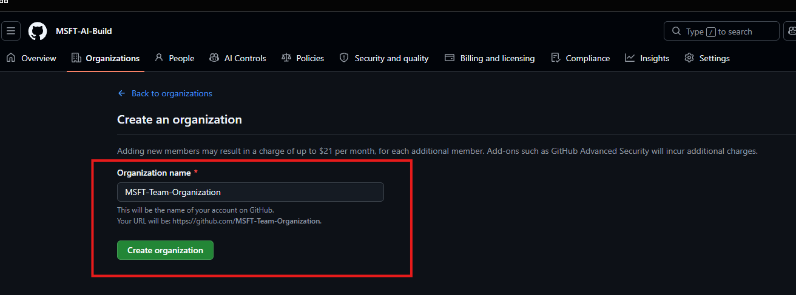
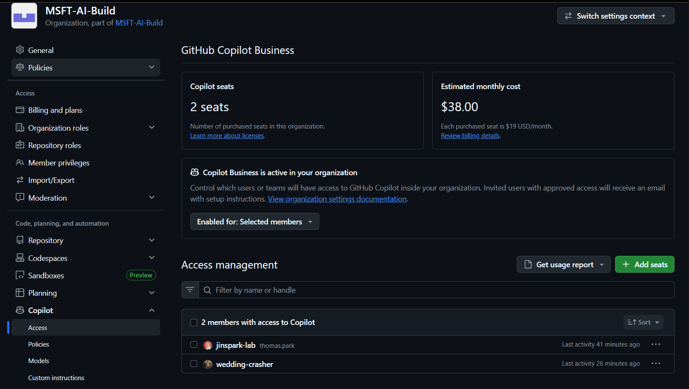
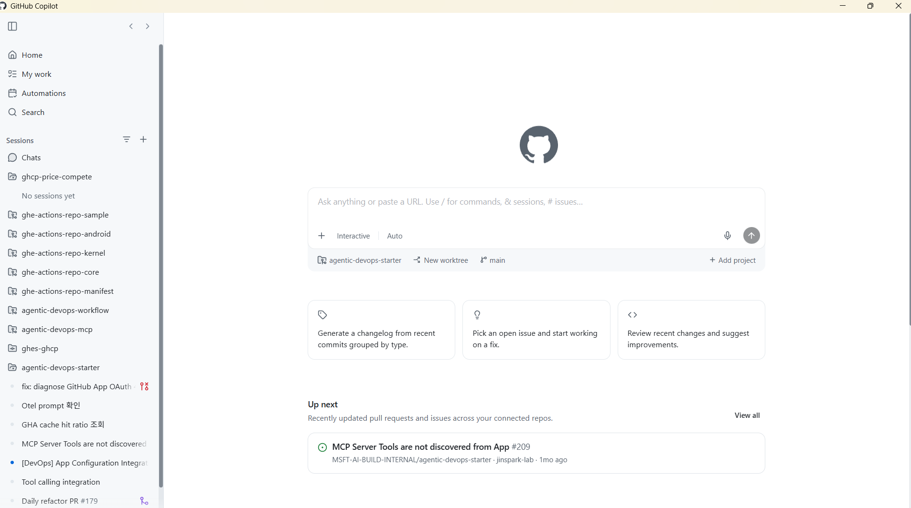

# 섹션 2: GitHub Copilot 시작 (라이센스 할당 및 GitHub Copilot App 기반 가이드)

## 📑 목차

- [2.1 GitHub Copilot 라이센스 모델](#21-github-copilot-라이센스-모델)
- [2.2 Copilot 라이센스 할당](#22-copilot-라이센스-할당)
- [2.3 GitHub Copilot App](#23-github-copilot-app)
- [2.4 체크리스트](#24-체크리스트)
- [참고 자료](#참고-자료)

---

GitHub Copilot 은 라이센스 및 사용량에 따른 비용 체계를 제공합니다.

---

## 2.1 GitHub Copilot 라이센스 모델

### Copilot Business vs Enterprise 비교

#### 가격 및 AI 크레딧

| 항목 | Copilot Business | Copilot Enterprise |
|------|------------------|--------------------|
| **월 비용 (사용자당)** | $19 USD | $39 USD |
| **GitHub AI Credits (사용자당/월)** | 1,900 | 3,900 |
| **AI Credits 풀링** | Organization 단위 공유 | Enterprise 단위 공유 |
| **추가 사용 시** | $0.01/크레딧 (한도 설정 가능) | $0.01/크레딧 (한도 설정 가능) |

> 💡 코드 자동 완성(Inline Suggestions)과 Next Edit Suggestions는 AI 크레딧을 소비하지 않으며, 유료 플랜에서 무제한으로 제공됩니다. Chat, Agent Mode, Code Review, Cloud Agent, CLI 등은 AI 크레딧을 소비합니다.

#### 기능 비교

| 기능 | Copilot Business | Copilot Enterprise |
|------|------------------|--------------------|
| **코드 자동 완성 (Inline Suggestions)** | ✅ 무제한 | ✅ 무제한 |
| **Next Edit Suggestions** | ✅ | ✅ |
| **Copilot Chat (IDE)** | ✅ | ✅ |
| **Copilot Chat (GitHub.com / Mobile)** | ✅ | ✅ |
| **CLI 지원** | ✅ | ✅ |
| **Agent Mode** | ✅ | ✅ |
| **Cloud Agent (Coding Agent)** | ✅ | ✅ |
| **PR 요약 (Pull Request Summary)** | ✅ | ✅ |
| **Copilot Code Review** | ✅ | ✅ |
| **MCP 서버 연동** | ✅ | ✅ |
| **Copilot Extensions** | ✅ | ✅ |
| **Custom Instructions** | ✅ | ✅ |
| **Copilot Spaces** | ✅ | ✅ |
| **코드베이스 인덱싱 (Semantic Code Search)** | ✅ | ✅ (더 많은 관리 옵션) |
| **IP 면책 (IP Indemnity)** | ✅ | ✅ |
| **콘텐츠 제외 (Content Exclusion)** | ✅ | ✅ |
| **관리자 정책 제어** | ✅ (Organization 수준) | ✅ (Enterprise 수준 + 고급 정책) |
| **Audit Log 통합** | ✅ | ✅ |
| **Copilot Metrics API** | ✅ | ✅ |
| **SAML SSO / SCIM** | ✅ | ✅ |

> 💡 **권장**: 대부분의 개발팀은 **Copilot Business**로 충분합니다. 더 높은 수준의 관리 정책 또는 Preview 기능의 빠른 지원이 필요하거나, 더 많은 AI 크레딧 풀이 필요한 경우 **Copilot Enterprise**를 선택하세요.

---

## 2.2 Copilot 라이센스 할당

### Step 1: Enterprise에서 사용자 체계 정의

GitHub Enterprise 와 GitHub Copilot 을 새로 구성하신다면 Member 체계를 먼저 구성하시는게 좋으며, 본 워크샵은 Enterprise Team 기반 시스템 구축을 가이드합니다.

1. GitHub Enterprise 메뉴로 이동합니다.

2. **Organization** 메뉴 선택 후 Create Organization 버튼 클릭합니다.

GitHub Organization 에 사용자를 할당하고 GitHub Enterprise License Seat 를 부여할 수 있습니다.
새로운 사용자에게 GitHub Enterprise 라이센스를 부여하는 경우 라이센스 비용이 할당될 수 있습니다.

3. Organization 이 생성되면, Enterprise 메뉴에서 **People** 메뉴를 선택합니다.

4. 좌측 메뉴에 **Enterprise teams** 를 클릭합니다. 엔터프라이즈 및 비용을 관리하면 간편하게 권한 및 비용 관리를 할 수 있습니다.

5. Create Enterprise Team 메뉴를 클릭 후 내용을 알맞게 입력합니다. 특정 Organization 에 대해서만 Access 를 부여할 수도 있습니다.

6. 만들어진 Team 을 클릭하고 Add Member 를 통해 특정 멤버를 할당할 수 있습니다.

Team 은 Enterprise 레벨에서 만들 수도 있고, Organization 레벨에서 생성할 수도 있습니다.
엔터프라이즈 환경에 알맞게 Team 을 설정해서 관리하시는 것을 추천합니다.

### Step 2: Copilot Seat 할당

GitHub Copilot 라이센스는 Enterprise 레벨에서 할당을 관리할 수도 있고, Organization 레벨에서 관리할 수도 있습니다.

각각의 관리 체계에 대한 차이점은 다음과 같습니다.

| 항목 | Enterprise 레벨 관리 | Organization 레벨 관리 |
|------|---------------------|----------------------|
| **할당 범위** | Enterprise 내 모든 Organization 멤버 대상 | 특정 Organization 멤버 대상 |
| **할당 방식** | Enterprise → Settings → Copilot에서 전체 정책 설정 | Organization → Settings → Copilot → Access에서 할당 |
| **세분화 수준** | Organization 단위로 활성화/비활성화 | Team 또는 개별 사용자 단위로 할당 가능 |
| **할당 옵션** | `All organizations` / `Selected organizations` | `All members` / `Selected teams/members` |
| **정책 우선순위** | Enterprise 정책이 Organization 정책보다 우선 | Enterprise에서 "No policy"일 때 자체 결정 가능 |
| **신규 멤버 자동 할당** | Organization 정책에 따름 | `All members` 선택 시 자동 할당 |
| **관리 권한** | Enterprise Owner 필요 | Organization Owner로 충분 |
| **적합한 환경** | 전사 일괄 도입, 중앙 집중 관리 | 팀별 단계적 도입, 세분화된 비용 관리 |

Enterprise 레벨과 Organization 레벨 양쪽에서 License 를 할당하거나 여러 Organization 에서 라이센스를 할당하더라도 Copilot Seat 가 중복해서 과금되지는 않습니다. :)

라이센스가 중첩될 경우 두 라이센스 중 높은 라이센스의 Plan 이 적용됩니다.

이번 워크샵에서는 Organization 단위의 할당을 가이드합니다.

1. Organization 메뉴에서 **Settings** → **Copilot** → **Access** 메뉴를 클릭합니다.

2. 할당 방식을 선택합니다. All Member 로 구성 시 자동으로 신규 유저들까지 모든 Member 할당이 가능합니다. Team / User 단위 세부 컨트롤이 필요하다면 해당 메뉴를 고려합니다.

3. 팀 기반 할당 시: **Add teams** → 대상 Team 을 검색하고 추가도 가능합니다.

---

## 2.3 GitHub Copilot App

GitHub Copilot 을 사용할 수 있는 방법은 여러 개가 있습니다.

GitHub Copilot은 다양한 환경에서 사용할 수 있습니다. 아래는 주요 사용 환경별 설치 및 접근 방법입니다.

| 환경 | 설치 방법 | 비고 |
|------|----------|------|
| **VS Code** | 확장 마켓플레이스에서 `GitHub Copilot` 검색 → Install (Copilot + Copilot Chat 동시 설치) | 가장 많이 사용되는 환경, Agent Mode 포함 |
| **JetBrains** (IntelliJ, PyCharm 등) | Settings → Plugins → Marketplace에서 `GitHub Copilot` 검색 → Install → IDE 재시작 | Agent Mode 지원 |
| **Visual Studio** | Extensions → Manage Extensions에서 `GitHub Copilot` 검색 → Install | .NET / C++ 개발에 적합 |
| **Xcode** | [GitHub Copilot for Xcode](https://github.com/github/CopilotForXcode) 설치 | Swift / iOS 개발용 |
| **Eclipse** | Eclipse Marketplace에서 `GitHub Copilot` 검색 → Install | Java 개발용 |
| **Neovim / Vim** | `Plug 'github/copilot.vim'` 추가 → `:PlugInstall` → `:Copilot auth` | 터미널 기반 개발 환경 |
| **GitHub.com** | 별도 설치 없음, Copilot 시트 할당 시 자동 활성화 | PR Summary, Code Review, Chat 등 |
| **GitHub Mobile** | App Store / Google Play에서 GitHub 앱 설치 | 모바일에서 Copilot Chat 사용 |
| **GitHub CLI** | `gh extension install github/gh-copilot` | 터미널에서 Copilot 사용 |
| **GitHub Copilot Desktop App** | [github.com/apps/desktop](https://github.com/apps/desktop) 에서 다운로드 | 독립 실행형 AI 코딩 앱 |
| **Windows Terminal** | Windows Terminal Canary 버전에서 기본 지원 | 터미널 내 Copilot Chat |

> 💡 **인증**: 모든 환경에서 최초 사용 시 GitHub 계정으로 인증이 필요합니다. EMU 환경에서는 IdP(Entra ID 등) SSO를 통해 인증됩니다.

GitHub Copilot App 은 다음 링크를 통해 다운로드받으실 수 있습니다.

https://docs.github.com/ko/copilot/how-tos/github-copilot-app/getting-started

GitHub Copilot App 을 설치하고 실행하면, 다양한 기능을 이용해보실 수 있습니다.

AI Chatbot 형태로 구현해보실 수도 있으며, 구성하신 GitHub Enterprise 의 Repository 와 연동해서 소스코드 기반의 작업을 해보실 수도 있습니다.

이 워크샵의 메인은 GitHub Copilot 을 위한 Governance 체계에 초점을 맞추고 있기 때문에 관련한 Task 에 초점을 맞추지는 않습니다.

효율적인 운영을 위해 엔드유저 관점에서 사용자가 어떻게 GitHub Copilot 을 사용할 수 있는지 체험해보시기를 권장드립니다.

---

## 2.4 체크리스트

### 2.1 GitHub Copilot 라이센스 모델

- [ ] Copilot 라이센스 플랜 결정 (Business / Enterprise)
- [ ] AI 크레딧 풀링 방식 및 추가 사용 한도 정책 검토

### 2.2 Copilot 라이센스 할당

- [ ] Enterprise Team 및 Organization 구성 완료
- [ ] 라이센스 할당 수준 결정 (Enterprise 레벨 / Organization 레벨)
- [ ] 대상 Organization 및 Team에 Copilot 시트 할당
- [ ] 시트 할당 현황 확인 (Settings → Copilot → Access)

### 2.3 GitHub Copilot App

- [ ] 개발 환경에 맞는 Copilot App 설치 (VS Code, JetBrains, Visual Studio 등)
- [ ] GitHub 계정 인증 완료 (EMU 환경: IdP SSO 인증)
- [ ] 인라인 코드 완성 동작 확인
- [ ] Copilot Chat 동작 확인

---

## 참고 자료

- [GitHub Copilot for Business 관리 가이드](https://docs.github.com/en/copilot/managing-copilot/managing-copilot-for-your-enterprise)
- [Copilot Billing API](https://docs.github.com/en/rest/copilot/copilot-business)
- [GitHub Copilot 시작 가이드](https://docs.github.com/en/copilot/getting-started-with-github-copilot)
- [Copilot Chat 사용법](https://docs.github.com/en/copilot/using-github-copilot/asking-github-copilot-questions-in-your-ide)
- [VS Code에서 Copilot 사용하기](https://code.visualstudio.com/docs/copilot/overview)
- [프롬프트 엔지니어링 가이드](https://docs.github.com/en/copilot/using-github-copilot/prompt-engineering-for-github-copilot)
- [Custom Instructions](https://docs.github.com/en/copilot/customizing-copilot/adding-repository-custom-instructions-for-github-copilot)

---

[⬅️ 이전: GitHub Enterprise 구성](../01-enterprise-setup/) | [🏠 메인](../README.md) | [➡️ 다음: AI 거버넌스](../03-ai-governance/)
