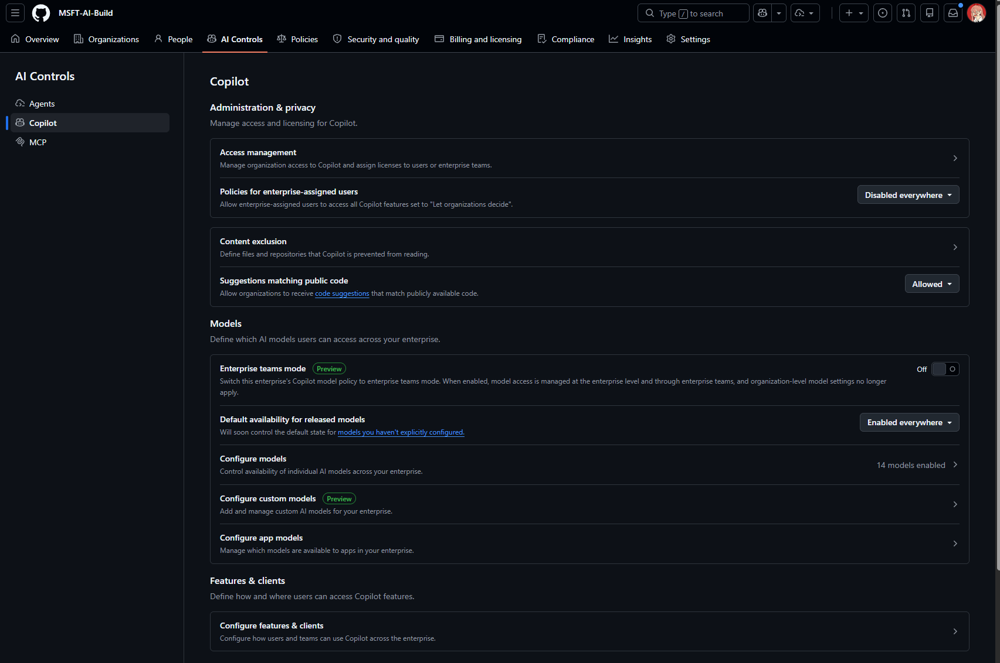
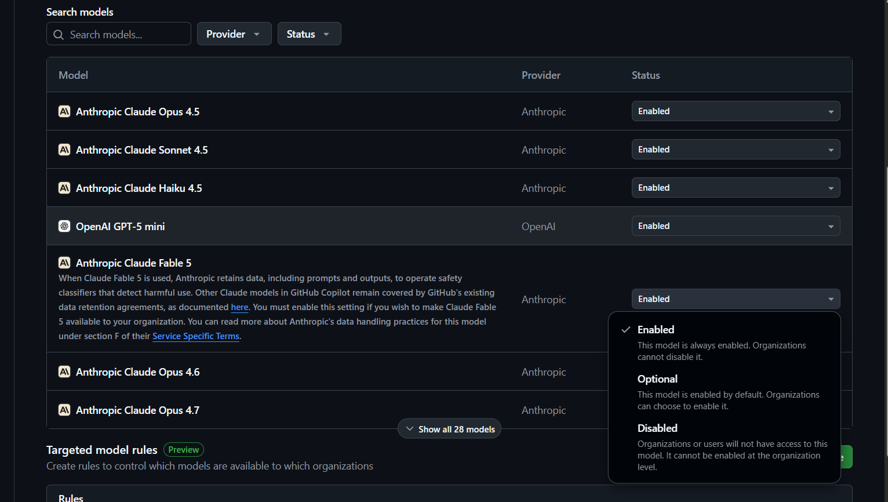
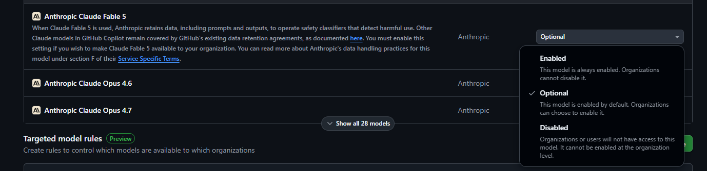
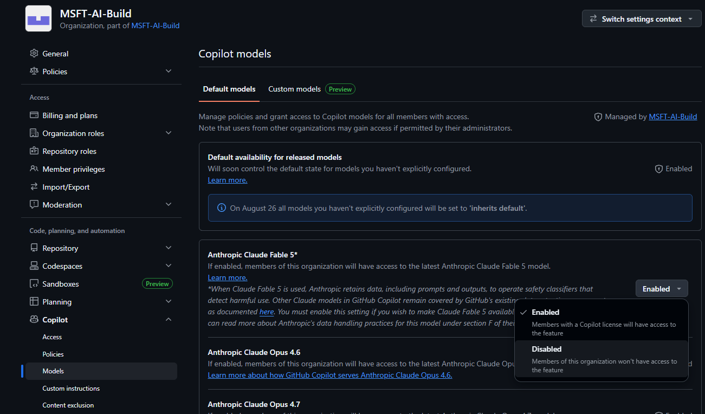
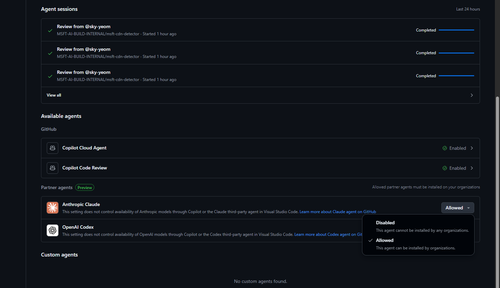
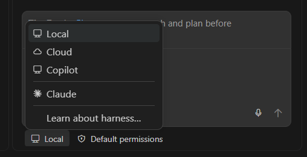

# 섹션 3: GitHub Copilot Enterprise AI-Governance (정책 체계 Workshop)

이번 섹션에서는 조직을 위해 구성한 GitHub Copilot 을 위한 관리 체계를 만드는 부분에 대해 가이드합니다.

이를 통해 조직의 보안 체계 안에서 효율적인 운영을 할 수 있는 정책을 정의할 수 있습니다.

---

## 3.1 Copilot 정책 계층 구조

GitHub Copilot 정책은 **Enterprise → Organization** 순서로 상속됩니다. Enterprise 정책은 Organization 정책보다 우선됩니다.

```
Enterprise 정책 (최상위 - 가장 강력)
│
│  Enterprise에서 "No policy" 로 설정하면
│  → Organization이 자체 정책을 설정 가능
│
│  Enterprise에서 "Enabled/Disabled" 로 설정하면
│  → Organization은 해당 설정을 재정의할 수 없음
│
├── Organization A 정책
│   └── (Enterprise 정책 범위 내에서 세부 설정)
│
└── Organization B 정책
    └── (Enterprise 정책 범위 내에서 세부 설정)
```

### 정책 상속 원칙

| Enterprise 설정 | Organization 옵션 | 설명 |
|-----------------|-------------------|------|
| **No policy** | Enabled / Disabled | Organization이 자유롭게 결정 |
| **Enabled** | Enabled (강제) | 모든 Organization에서 활성화 |
| **Disabled** | Disabled (강제) | 모든 Organization에서 비활성화 |

---

## 3.2 주요 Copilot 정책 항목

### 정책 매트릭스

| 정책 항목 | 설명 | 권장 설정 |
|-----------|------|-----------|
| **Copilot in IDE** | IDE에서 코드 완성 허용 | ✅ Enabled |
| **Copilot Chat in IDE** | IDE 내 Chat 기능 허용 | ✅ Enabled |
| **Copilot on GitHub.com** | GitHub.com에서 Chat 허용 | ✅ Enabled (Enterprise) |
| **Copilot in CLI** | CLI에서 Copilot 사용 허용 | ✅ Enabled |
| **Suggestions matching public code** | 공개 코드와 일치하는 Copilot 제안 차단 | 🔒 Blocked (권장) |
| **Copilot access to Bing** | 웹 검색 연동 허용 | 조직 판단 |
| **Copilot Pull Request Summary** | PR 요약 기능 허용 | ✅ Enabled (Enterprise) |
| **Copilot Code Review** | AI 코드 리뷰 허용 | ✅ Enabled (Enterprise) |
| **Copilot Knowledge Bases** | Knowledge Base 기능 허용 | ✅ Enabled (Enterprise) |


---

## 3.3 거버넌스 프레임워크 설계

### 단계별 거버넌스 도입

```
Phase 1: 기반 구축
├── Copilot 정책 기본 설정 (Enterprise 수준)
├── Content Exclusion 규칙 정의
├── Public code 매칭 필터 활성화
└── Audit Log 스트리밍 설정

Phase 2: 정책 세분화
├── Organization별 세부 정책 설정
├── 민감 리포지토리 Content Exclusion 확대
├── 사용량 모니터링 체계 구축
└── 개발자 교육 및 가이드라인 배포

Phase 3: 지속적 운영
├── 정기 정책 리뷰 (분기별)
├── 비활성 시트 관리 자동화
├── Copilot 사용 패턴 분석 및 최적화
├── 보안 감사 통합
└── 신규 기능 평가 및 정책 업데이트
```


---

## 3.4 정책 구성 실습

### Enterprise 레벨 모델 AI 정책 설정 실습



1. Enterprise 어드민을 통해 **AI Controls** → **Copilot** 메뉴에 접속합니다.

2. Policy 메뉴를 통해 Admin 관련 정책, 모델 관련 정책, AI Client 관련 정책 등을 정의할 수 있습니다.

3. 다음 정책을 설정하세요:

| 정책 | 설정 값 |
|------|---------|
| Copilot in IDE | Enabled |
| Suggestions matching public code | Block |
| Copilot Chat | Enabled |
| Copilot in CLI | No policy (Organization에 위임) |

4. Configure Model 을 선택해서 설정할 수 있는 모델들을 확인합니다.



5. Claude Fable 모델을 Enable 시켜서 Copilot Chat 을 통해 테스트합니다.

6. Claude Fable 모델을 Disable 시킨 뒤 Copilot Chat 을 통해 테스트해서 정책 적용을 테스트합니다.

7. Claude Fable 모델을 이번에는 Enterprise 레벨에서 Optional 로 구성합니다.



8. 생성한 Organization 으로 이동합니다. Organization 레벨에서 Claude Fable 모델에 대해 Disable 로 설정 후 테스트합니다.




### Enterprise 레벨에서 Partner Agent 설정



1. Enterprise 어드민을 통해 **AI Controls** -> **Agents** 메뉴를 클릭합니다.

2. 해당 메뉴에서는 현재 엔터프라이즈의 에이전트 세션을 확인하고 에이전트가 사용할 수 있는 도구를 정의할 수 있습니다.

3. Preview 기능을 통해 Anthropic Claude 와 OpenAI Codex 파트너 클라이언트를 Enable 합니다.



4. VS Code 를 통해 파트너 클라이언트 사용을 테스트합니다.


---

## 3.5 GitHub Copilot 정책 구성 Best Practice

### 1. 최소 권한 원칙 (Least Privilege)

- Enterprise 레벨에서는 **보안에 민감한 정책만 강제**하고, 나머지는 Organization에 위임합니다.
- 새로운 기능이 출시될 때 기본값을 "No policy"로 두고, 평가 후 활성화 여부를 결정합니다.

```
권장 Enterprise 강제 정책:
├── Suggestions matching public code → Block (강제)
├── Copilot in IDE → Enabled (강제)
└── 기타 정책 → No policy (Organization 위임)
```

### 2. Content Exclusion 전략

민감한 코드나 데이터가 포함된 파일/경로를 Copilot 컨텍스트에서 제외합니다.

| 제외 대상 | 예시 패턴 | 이유 |
|-----------|-----------|------|
| 시크릿/인증 정보 | `**/.env`, `**/secrets/**` | 자격 증명 노출 방지 |
| 규제 대상 데이터 | `**/pii/**`, `**/hipaa/**` | 컴플라이언스 준수 |
| 레거시 코드 | `**/deprecated/**` | 비권장 패턴 학습 방지 |
| 벤더 코드 | `**/vendor/**`, `**/third-party/**` | 라이선스 충돌 방지 |

> ⚠️ **제한 사항**: Content Exclusion은 심볼릭 링크 및 원격 파일시스템의 리포지토리에는 적용되지 않습니다. 또한 일부 Copilot Chat 모드 및 에디터에서는 exclusion 설정이 완전히 반영되지 않을 수 있으므로, 프로젝트마다 적용 범위를 확인하세요.

### 3. 단계적 롤아웃 (Phased Rollout)

조직 전체에 한 번에 배포하지 않고, 파일럿 그룹부터 단계적으로 확대합니다.

```
Week 1-2:  파일럿 팀 (10-20명) → 정책 검증 및 피드백 수집
Week 3-4:  얼리 어답터 확대 (50-100명) → 정책 미세 조정
Week 5-8:  전체 조직 확대 → 안정화 및 모니터링
Week 9+:   지속적 최적화 → 사용량 분석 기반 정책 개선
```

### 4. 모델 정책 관리

- **프로덕션 환경**: 검증된 모델만 Enterprise 레벨에서 Enabled로 설정합니다.
- **실험 환경**: 신규 모델은 특정 Organization에서만 Optional로 허용하여 평가합니다.
- **정기 검토**: 분기별로 사용 가능한 모델 목록을 검토하고 불필요한 모델을 비활성화합니다.

### 5. Audit & Compliance 체계

| 항목 | 권장 설정 | 목적 |
|------|-----------|------|
| Audit Log 정책 수립 | 스트리밍을 통해 SIEM 연동 (Splunk, Sentinel 등) 또는 Export 를 통해 증적 확인 및 제출. [Observability 워크샵](../04-observability/README.md) 참고 | 실시간 모니터링 |
| 보존 기간 | GitHub 기본 180일, 규제 요건 시 외부 SIEM으로 장기 보존 | 규제 준수 |
| 알림 규칙 | 비정상 사용 패턴 탐지 | 보안 위협 대응 |
| 정기 리뷰 | 분기별 정책 감사 | 정책 실효성 확인 |

### 6. 시트 관리 및 비용 최적화

- **비활성 시트 정책**: GitHub에는 내장된 자동 회수 기능이 없으므로, GitHub API + GitHub Actions 워크플로우를 활용하여 일정 기간(예: 25~30일) 미사용 시트를 자동 회수하는 자동화를 구축합니다.
- **사용량 대시보드**: Organization별 활성 사용자 수와 활용도를 주기적으로 모니터링합니다.
- **온보딩/오프보딩 연동**: HR 시스템과 연계하여 입퇴사 시 자동으로 시트를 할당/회수합니다.
- **알림 프로세스**: 시트 회수 전 사용자에게 사전 알림(이메일/Slack)을 발송하여 재활성화 기회를 제공합니다.

### 7. 개발자 가이드라인 병행

정책 설정만으로는 충분하지 않습니다. 개발자가 Copilot을 안전하고 효과적으로 사용할 수 있도록 가이드라인을 병행합니다.

- ✅ Copilot 제안 코드는 반드시 리뷰 후 수락 (Human In The Loop)
- ✅ 민감 정보(API 키, 비밀번호 등)를 프롬프트에 포함하지 않기
- ✅ 생성된 코드의 라이선스 호환성 확인
- ✅ 보안 취약점 스캐닝 파이프라인과 병행 사용
- ✅ Copilot 제안을 그대로 사용하지 않고 컨텍스트에 맞게 리뷰 및 수정 (Human In the Loop)

---

## 3.6 체크리스트

### 3.1–3.2 정책 계층 및 기본 설정

- [ ] Enterprise 수준 Copilot 정책 설정 완료
- [ ] Enterprise → Organization 정책 상속 구조 확인
- [ ] Public code 매칭 필터 Block 활성화
- [ ] Content Exclusion 규칙 정의 및 적용
- [ ] Content Exclusion 제한 사항(심볼릭 링크, 원격 파일시스템) 인지

### 3.3 거버넌스 프레임워크 설계

- [ ] 단계별 거버넌스 도입 계획 수립 (Phase 1~3)
- [ ] 거버넌스 정책 문서 작성
- [ ] 정기 리뷰 일정 수립 (분기별)

### 3.4 정책 구성 실습

- [ ] Enterprise 레벨 AI 모델 정책 설정 (Enabled/Disabled/Optional)
- [ ] Organization 레벨 모델 정책 위임 및 테스트
- [ ] Partner Agent (Anthropic Claude, OpenAI Codex) 설정 및 테스트

### 3.5 Best Practice 적용

- [ ] 최소 권한 원칙에 따른 정책 위임 구조 설계
- [ ] Content Exclusion 전략 수립 (시크릿, 규제 데이터, 레거시, 벤더 코드)
- [ ] 단계적 롤아웃 계획 수립 (파일럿 → 전체 확대)
- [ ] 모델 정책 관리 체계 수립 (프로덕션/실험 환경 분리, 분기별 검토)
- [ ] Audit Log 스트리밍 설정 (SIEM 연동 또는 Export)
- [ ] 비활성 시트 회수 자동화 구축 (API + Actions)
- [ ] 개발자 Copilot 사용 가이드라인 배포

---

## 참고 자료

- [Copilot 정책 관리](https://docs.github.com/en/copilot/managing-copilot/managing-policies-for-copilot-in-your-enterprise)
- [Content Exclusion 설정](https://docs.github.com/en/copilot/managing-copilot/managing-github-copilot-in-your-organization/configuring-content-exclusions-for-github-copilot)
- [IP Indemnity](https://docs.github.com/en/copilot/responsible-use-of-github-copilot-features/github-copilot-ip-indemnity)
- [Audit Log 이벤트](https://docs.github.com/en/enterprise-cloud@latest/admin/monitoring-activity-in-your-enterprise/reviewing-audit-logs-for-your-enterprise/audit-log-events-for-your-enterprise)
- [Audit Log 스트리밍](https://docs.github.com/en/enterprise-cloud@latest/admin/monitoring-activity-in-your-enterprise/reviewing-audit-logs-for-your-enterprise/streaming-the-audit-log-for-your-enterprise)
