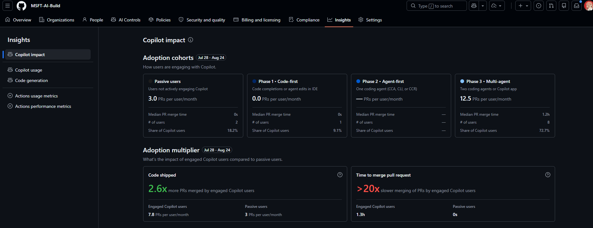
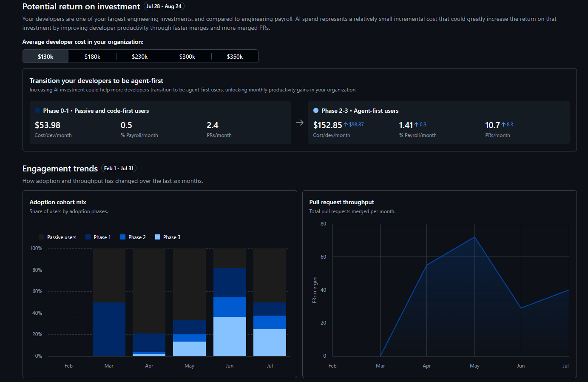
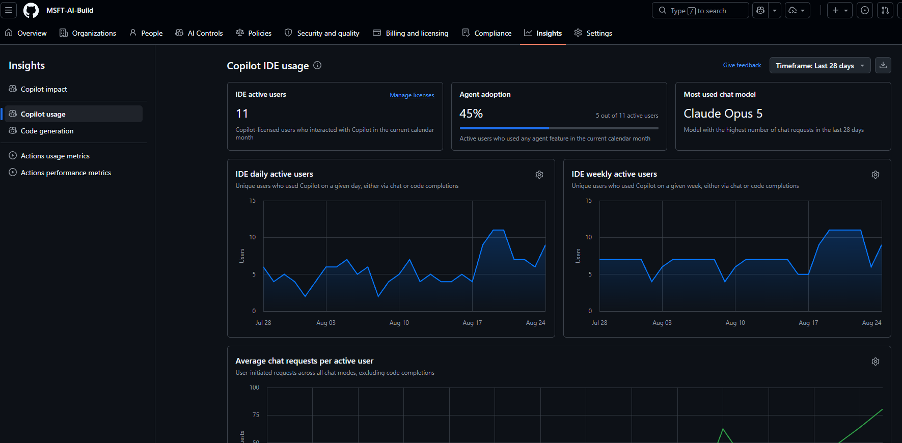
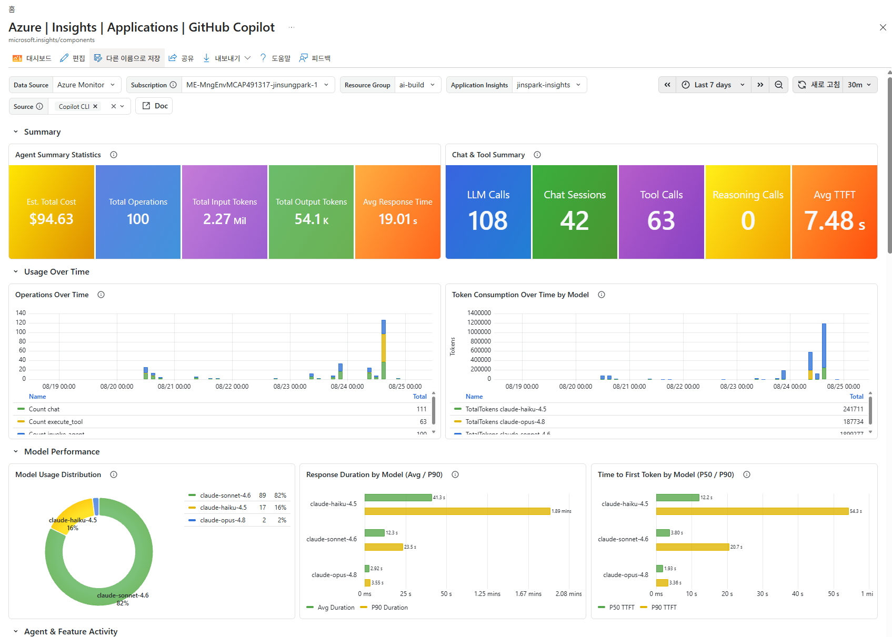
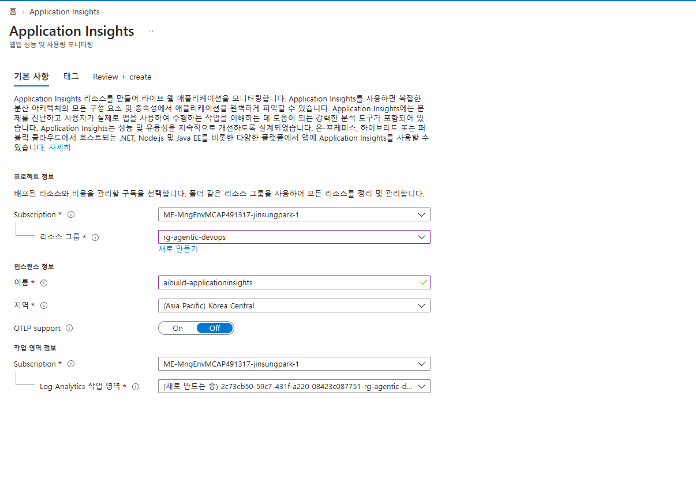
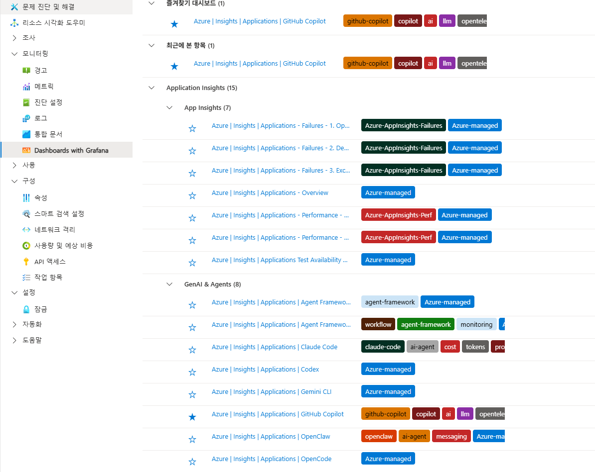
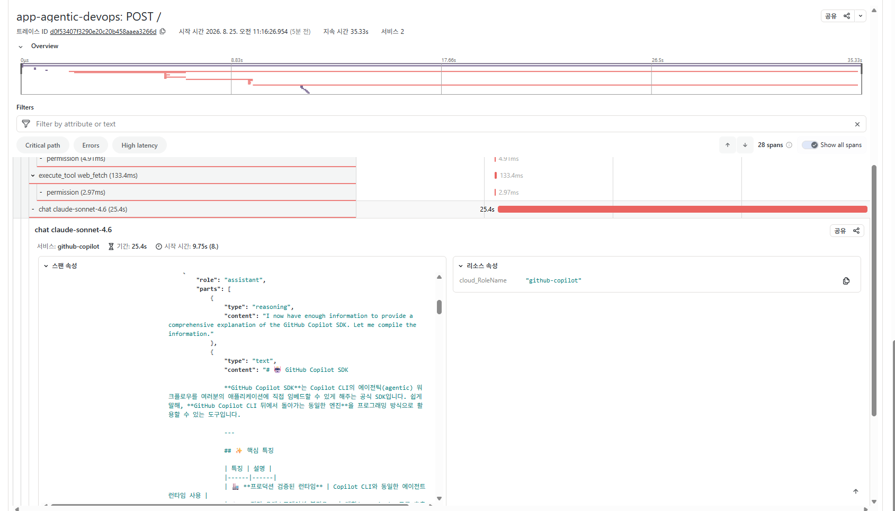
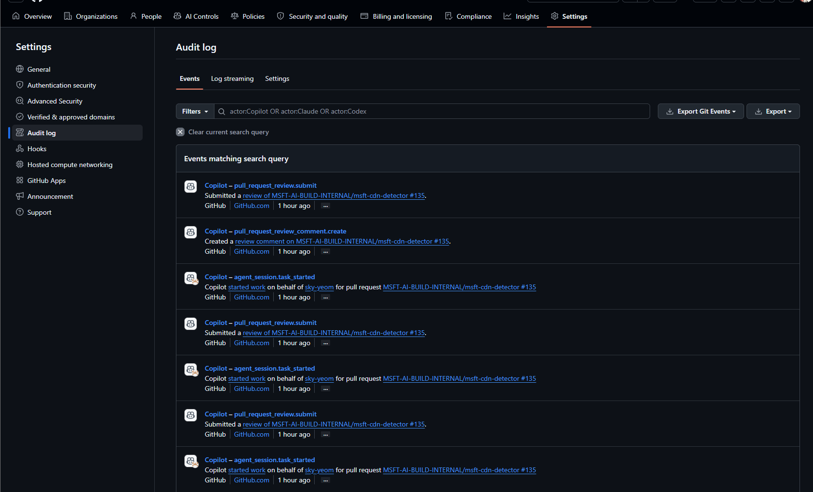
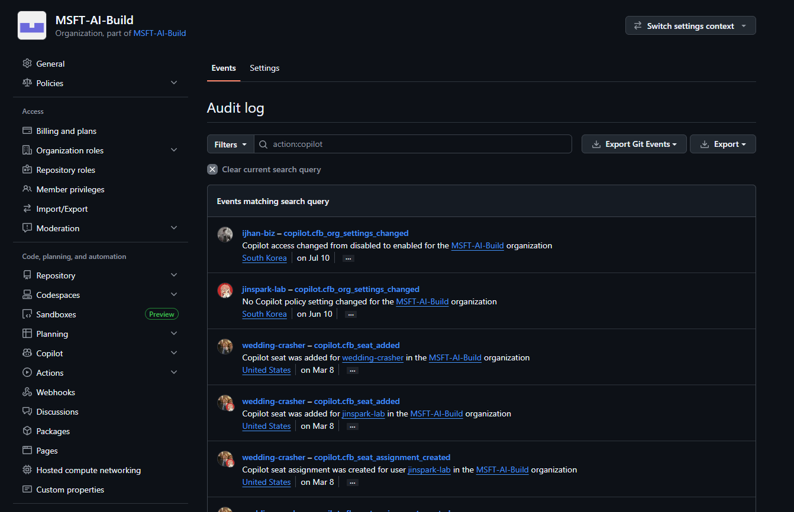

# 섹션 4: GitHub Copilot Observability

단순히 도입하고 사용하는 것 이상으로 중요한 것이 운영입니다. 효과적인 운영과 조직 내 성숙도의 함양을 위해서는 이를 위한 데이터가 필요하고, 데이터는 Observability 에서 나옵니다.

이번 섹션에서는 구성된 GitHub Copilot 사용에 대해 지속적인 가시성을 가질 수 있는 방안을 알아봅니다.

---

## 4.1 GitHub Enterprise – Insights

GitHub Enterprise 에는 GitHub 에서 제공하는 서비스들을 위한 Insight Dashboard 를 제공합니다. 특히 GitHub Copilot 에 대해 Insights 대시보드를 통해 사용량 패턴을 파악하고 조직이 주로 어떤 작업을 처리하는지, 비용을 효과적으로 사용하고 있는지 전반적으로 파악할 수 있습니다.

### Copilot Impact 대시보드를 활용한 ROI 측정




코딩 에이전트의 ROI 나 성숙도를 측정하는건 쉬운 일이 아닙니다. 초창기에는 LOC(Lines Of Code) 가 측정을 위한 주요 지표로 여겨졌으나, 생성형 AI 가 발달하면서부터는 의미없는 수치가 되어버렸습니다.

GitHub Copilot 의 경우 PR (Pull Request) 기반으로 Impact 측정을 강화했습니다. GitHub Enterprise 생태계 내에서 사용하는 경우 Main Stream Merge 라는 단순 LOC 보다 효과적인 지표로 실제 AI 의 효율성을 판단할 수 있습니다.


Impact 대시보드는 다음 경로로 접근 가능합니다.

```
접근 경로:
GitHub.com → Enterprise Account → Insights → Copilot Impact
```

Copilot Impact는 GitHub이 제공하는 내장 ROI 측정 도구로, Copilot 도입 전후의 개발 생산성 변화를 정량적으로 보여줍니다.



GitHub Enterprise 관리자는 이를 통해 Enterprise 수준에서 Copilot 사용 현황을 확인할 수 있고, 조직의 Coding Agent 성숙도에 대해 측정할 수 있습니다. 위와 같이 현재 어떤 Phase 에 조직이 위치하고, 덜 사용하는 사용자들 & 많이 사용하는 슈퍼 유저들의 패턴을 한눈에 파악할 수 있습니다.


#### Copilot Impact 활용 시나리오

##### 시나리오 1: 전사 도입 효과 보고

```
보고 항목 예시:

1. 전체 시트 활용률
   - 할당: 500석, 활성 사용자: 420명 (활용률: 84%)

2. 생산성 향상 지표
   - 평균 코드 수락률: 35%
   - PR Cycle Time 단축: 평균 22% 감소
   - 주간 수락된 코드 라인: 85,000 lines

3. 비용 효과 분석
   - 월 Copilot 비용: $19,500 (500석 × $39)
   - 절약 시간 환산: 약 1,700시간/월
   - 절약 비용 환산: 약 $127,500/월 (시간당 $75 기준)
   - ROI: 약 554%
```

##### 시나리오 2: 팀별 도입 효과 비교

Copilot Impact에서 팀별 필터를 적용하여 다음을 비교할 수 있습니다:

- 팀별 수락률 차이 → 교육 우선순위 결정
- 팀별 PR Cycle Time 변화 → 효과가 큰 팀 식별
- 팀별 Chat 활용률 → 기능별 활용도 차이 파악

### 주요 활용 가이드

다음과 같이 주요 지표 활용을 통해 얼마나 조직이 GitHub Copilot 을 사용하고 있는지 수치화시킬 수 있습니다. 이를 기반으로 비용 절감을 위한 의사결정이나, 조직 관리 체계 변경 등에 대해 고려해볼 수 있습니다.

| KPI | 계산 방식 | 목표치 (예시) | 측정 주기 |
|-----|-----------|---------------|-----------|
| **시트 활용률** | active_users / total_seats × 100 | > 80% | 주간 |
| **코드 수락률** | acceptances / suggestions × 100 | > 30% | 주간 |
| **Chat 참여율** | chat_users / active_users × 100 | > 50% | 월간 |
| **PR Summary 활용률** | PRs with summary / total PRs × 100 | > 60% | 월간 |
| **PR Cycle Time 단축률** | (before - after) / before × 100 | > 15% | 월간 |

---

### Copilot Usage 대시보드

Insights 메뉴의 왼쪽 메뉴에 Copilot Usage 대시보드를 선택하시면, Copilot 사용량에 대한 측정 인사이트를 얻을 수 있습니다.



Usage 대시보드에서는 다음과 같은 주요 지표를 확인할 수 있습니다:

- **Agent Adoption**: Copilot Agent 기능의 채택률을 확인할 수 있어, 조직 내에서 Agent 모드가 얼마나 활발하게 사용되고 있는지 파악할 수 있습니다.
- **Most Used Chat Model**: Chat에서 가장 많이 사용되는 AI 모델(예: GPT-4o, Claude Sonnet 등)을 확인하여, 사용자들이 선호하는 모델 트렌드를 파악할 수 있습니다.
- **Language Breakdown**: 어떤 프로그래밍 언어에서 GitHub Copilot이 가장 많이 활용되고 있는지 확인할 수 있어, 조직 내 주요 기술 스택과 Copilot 활용 패턴을 분석할 수 있습니다.

### Organization 수준 Insights

Enterprise 하위 각 Organization에서도 Copilot 현황을 확인하여 보다 세부적인 데이터를 얻을 수 있습니다. 특히 Enterprise 레벨 관리자가 중앙 통제하고, 각 조직 별로 Organization 레벨에서 별도로 관리하는 팀이 있는 경우, 이를 유용하게 사용할 수 있습니다.

```
접근 경로:
GitHub.com → Organization → Insights
```

Organization 수준에서는 추가로 다음을 확인할 수 있습니다:

- **팀별 사용 현황**: Team 단위로 사용률과 수락률 비교
- **멤버별 활동**: 개별 사용자의 Copilot 활동 여부 (활성/비활성)
- **시트 관리**: 비활성 사용자 식별 및 시트 재할당 근거

### Insights 데이터 활용 팁

Enterprise 레벨이 아닌 Organization 레벨로 세분화시킬 경우 다음과 같은 사용 사례에 응용하실 수 있습니다.

1. **주간 리포트 생성**: Insights 데이터를 기반으로 주간 Copilot 도입 리포트 작성
2. **부서별 비교**: Organization/Team별 사용률을 비교하여 교육이 필요한 그룹 식별
3. **트렌드 분석**: 시간에 따른 수락률 변화를 추적하여 Copilot 숙련도 향상 확인
4. **비용 최적화**: 비활성 시트를 식별하여 라이센스 비용 최적화

---

## 4.2 Azure Application Insights 통합 대시보드 구성



Azure Application Insights 를 이용하신다면 GitHub Copilot 사용에 대해 Prompt / Response 레벨의 Detail 한 수준의 가시성을 제공하는 대시보드를 Built-In 으로 제공받으실 수 있습니다.

이는 Open Telemetry 를 이용해 코딩 에이전트의 모든 수준에 대한 가시성을 제공하므로 조직에서 사용하는 Coding Agent 에 대한 통합 대시보드를 별도 Ops 구성 없이 제공받으실 수 있습니다.

### Azure Application Insights 대시보드 구성



- Azure Portal 에 접속하여 Application Insights 를 선택합니다. 
- 위와 같이 리소스 그룹을 지정하고 Region 에 신규 Application Insights 를 생성하실 수 있습니다.
- 리소스가 생성된다면 Connection String 을 저장합니다.



Azure Portal 에 접속해서 Application Insights 를 생성하는 경우 Managed Grafana 대시보드에서 위와 같이 빌트인 Dashboard 리스트를 확인하실 수 있습니다.

이는 Azure 에서 기본으로 제공하는 Coding Agent 별 대시보드로 별다른 Grafana 대시보드 구성이나 프로비저닝 작업 없이도 제공받으실 수 있습니다.

GitHub Copilot 의 Open Telemetry Endpoint 를 설정만 해주신다면, 바로 연동해서 사용하실 수 있습니다.

### GitHub Copilot OTEL 설정

GitHub Copilot에서 OpenTelemetry를 활성화하면, Agent 세션의 Traces, Metrics, Events 데이터를 외부 관측 시스템으로 전송할 수 있습니다.

OpenTelemetry 를 통해 기존에 엔터프라이즈에서 갖고있는 SIEM 으로 연동하거나, Azure Application Insights 로 전송해서 통합 대시보드를 구축하실 수도 있습니다.

본 워크샵에서는 Azure Application Insights 기반의 통합 대시보드를 가이드합니다.

#### 수집 데이터 유형

Copilot 은 OpenTelemetry 를 통해 다음 3가지 유형의 데이터를 전송합니다:

| 유형 | 설명 | 예시 |
|------|------|------|
| **Traces** | Agent 세션의 전체 실행 흐름을 계층적 스팬 트리로 기록 | 모델 호출 → Tool 실행 → 응답 생성 |
| **Metrics** | 시간에 따른 수치 측정값 | 토큰 사용량, API 지연시간, 세션 수 |
| **Events** | 특정 시점의 개별 액션 기록 | 편집 수락/거부, 사용자 피드백, 세션 시작 |

> ⚠️ **보안 참고**: 기본적으로 Prompt, Response, Tool 인자 등의 콘텐츠는 수집되지 않습니다. `captureContent` 옵션을 활성화하면 전체 내용을 캡처할 수 있으나, 민감 정보(코드, 파일 내용, 사용자 프롬프트)가 포함될 수 있으므로 신뢰할 수 있는 환경에서만 활성화하시기 바랍니다.

#### 연동 아키텍처

GitHub Copilot 의 OTEL 데이터는 OTLP (OpenTelemetry Protocol) 를 통해 전송되며, Azure Application Insights 와 연동 시 다음과 같은 아키텍처로 구성합니다:

```
Copilot Client (VS Code / CLI)
        │
        │  OTLP (HTTP/gRPC)
        ▼
OpenTelemetry Collector
        │
        │  Azure Monitor Exporter
        ▼
Azure Application Insights
        │
        ▼
Managed Grafana Dashboard
```

OTLP Collector 를 중간에 배치하여 데이터 변환, 필터링, 라우팅을 처리하고, Azure Monitor Exporter 를 통해 Application Insights 로 전달합니다.

**OpenTelemetry Collector 구성 예시 (`otel-config.yaml`):**

```yaml
receivers:
  otlp:
    protocols:
      http:
        endpoint: "0.0.0.0:4318"
      grpc:
        endpoint: "0.0.0.0:4317"

exporters:
  azuremonitor:
    connection_string: "<APPLICATION_INSIGHTS_CONNECTION_STRING>"

service:
  pipelines:
    traces:
      receivers: [otlp]
      exporters: [azuremonitor]
    metrics:
      receivers: [otlp]
      exporters: [azuremonitor]
```

#### VS Code (GitHub Copilot Chat) 설정

VS Code의 `settings.json`에 다음 설정을 추가합니다. 설정 네임스페이스는 `github.copilot.chat.otel.*` 입니다:

```json
{
  "github.copilot.chat.otel.enabled": true,
  "github.copilot.chat.otel.exporterType": "otlp-http",
  "github.copilot.chat.otel.otlpEndpoint": "http://<YOUR_OTEL_COLLECTOR>:4318",
  "github.copilot.chat.otel.captureContent": false
}
```

**주요 VS Code 설정 항목:**

| 설정 | 타입 | 기본값 | 설명 |
|------|------|--------|------|
| `otel.enabled` | boolean | `false` | OTel 데이터 전송 활성화 |
| `otel.exporterType` | string | `"otlp-http"` | 전송 프로토콜 (`otlp-http`, `otlp-grpc`, `console`, `file`) |
| `otel.otlpEndpoint` | string | `"http://localhost:4318"` | OTLP Collector 엔드포인트 |
| `otel.captureContent` | boolean | `false` | Prompt/Response 전체 내용 캡처 여부 |
| `otel.maxAttributeSizeChars` | integer | `0` | 콘텐츠 속성 최대 문자 수 (`0` = 무제한) |

#### GitHub Copilot CLI 설정

환경 변수를 통해 OpenTelemetry Endpoint를 설정합니다:

```bash
# 기본 OTLP 설정
export OTEL_EXPORTER_OTLP_ENDPOINT="http://<YOUR_OTEL_COLLECTOR>:4318"
export OTEL_EXPORTER_OTLP_HEADERS="Authorization=Bearer <YOUR_TOKEN>"

# Copilot 전용 환경 변수 (선택)
export COPILOT_OTEL_ENABLED=true
export COPILOT_OTEL_CAPTURE_CONTENT=false
```

**주요 환경 변수:**

| 환경 변수 | 기본값 | 설명 |
|-----------|--------|------|
| `OTEL_EXPORTER_OTLP_ENDPOINT` | - | 표준 OTLP 엔드포인트 URL |
| `OTEL_EXPORTER_OTLP_HEADERS` | - | 인증 헤더 (예: `Authorization=Bearer token`) |
| `OTEL_EXPORTER_OTLP_PROTOCOL` | `http/protobuf` | OTLP 프로토콜 (`grpc` 또는 `http`) |
| `COPILOT_OTEL_ENABLED` | `false` | Copilot OTel 활성화 |
| `COPILOT_OTEL_ENDPOINT` | - | Copilot 전용 엔드포인트 (표준 변수보다 우선) |
| `COPILOT_OTEL_CAPTURE_CONTENT` | `false` | Prompt/Response 콘텐츠 캡처 |
| `OTEL_SERVICE_NAME` | `copilot-chat` | 서비스 이름 |
| `OTEL_RESOURCE_ATTRIBUTES` | - | 추가 리소스 속성 (`key=val,key2=val2`) |

#### Enterprise Managed Settings (중앙 관리)

Enterprise 환경에서는 `managed-settings.json` 의 `telemetry` 블록을 통해 조직 전체의 OTel 설정을 중앙에서 관리할 수 있습니다. 이 설정은 개별 사용자의 환경 변수나 VS Code 설정보다 우선 적용됩니다.

```json
{
  "telemetry": {
    "enabled": true,
    "endpoint": "https://otel-collector.example.com",
    "protocol": "http/protobuf",
    "captureContent": false,
    "lockCaptureContent": true,
    "serviceName": "copilot",
    "resourceAttributes": {
      "deployment.environment": "production"
    },
    "headers": {
      "Authorization": "Bearer <YOUR_TOKEN>"
    }
  }
}
```

**배포 방법:**
- **MDM**: Windows Registry, macOS Managed Preferences 를 통한 배포
- **파일 기반**: `managed-settings.json` 파일 직접 배포
- **서버 기반**: Organization 의 `.github-private` 리포지토리를 통한 배포

> **💡 Tip**: `lockCaptureContent: true` 로 설정하면 사용자가 `captureContent` 를 임의로 변경할 수 없어, 보안 정책을 일관되게 유지할 수 있습니다.

#### 설정 우선순위

여러 설정 소스가 존재할 경우, 다음 순서로 우선순위가 적용됩니다:

```
1. MDM Managed Settings (최우선)
2. Server Managed Settings
3. File-based Managed Settings
4. Environment Variables
5. VS Code User Settings (최하위)
```

> **💡 Tip**: 설정 후 VS Code를 재시작하면 트레이스 데이터가 OTLP Collector 를 통해 Application Insights로 전송되기 시작합니다. 데이터가 대시보드에 반영되기까지 수 분이 소요될 수 있습니다.

### Trace 확인

Azure Application Insights 로 OpenTelemetry 로그를 전송하게 구성한다면, Grafana Dashboard 에서 Trace 를 확인하실 수 있습니다.

이를 통해 모델 호출, Tool Calling, Input 토큰 사용량, Output Token 사용량, 평균 TTFT 등을 확인하실 수 있습니다.



또한 위와 같이 보안 규제 만족을 위해 Prompt 및 Response 에 대한 모니터링도 구성하실 수 있습니다. 참고로 Prompt 및 Reponse 의 수집을 위해서는 OpenTelemetry 전송 시 capture_content 파라미터를 true 로 보내주셔야합니다.

Application Insights 에 이를 위한 분석 패널을 만들어서 이상 탐지 시스템 등을 만드는데 활용해보실 수도 있습니다.

---

## 4.3 Audit Log 관리

### Audit Log 개요



GitHub Enterprise의 Audit Log는 Copilot 관련 모든 관리 활동을 기록합니다. 보안 감사, 컴플라이언스 요건 충족, 정책 변경 추적에 필수적입니다.

### Audit Log 접근 경로

GitHub 는 Audit 로그에 대해 Enterprise 레벨과 Organization 레벨 각각에서 지원합니다.

감사 레벨에 알맞게 Audit Log 에 대한 확인 및 보안 설정을 고려해보시는것을 권장드립니다.

```
Enterprise 수준:
GitHub.com → Enterprise Account → Settings → Audit log

Organization 수준:
GitHub.com → Organization → Settings → Logs → Audit log
```

### Copilot 관련 Audit Log 이벤트

| 이벤트 카테고리 | 이벤트 | 설명 |
|----------------|--------|------|
| `copilot` | `copilot.seat_added` | 사용자에게 Copilot 시트 할당 |
| `copilot` | `copilot.seat_removed` | 사용자의 Copilot 시트 제거 |
| `copilot` | `copilot.seat_cancelled` | 시트 할당 취소 |
| `copilot` | `copilot.policy_update` | Copilot 정책 설정 변경 |
| `copilot` | `copilot.content_exclusion_changed` | Content Exclusion 규칙 변경 |
| `copilot` | `copilot.editor_plugin_update` | 에디터 플러그인 설정 변경 |
| `copilot` | `copilot.cfb_settings_changed` | Copilot for Business 설정 변경 |

### Audit Log 필터링



웹 UI에서 다음 필터를 사용하여 Copilot 관련 로그를 조회할 수 있습니다:

```
검색 쿼리 예시:

# Copilot 관련 모든 이벤트
action:copilot

# 시트 할당/제거 이벤트
action:copilot.seat_added
action:copilot.seat_removed

# 정책 변경 이벤트
action:copilot.policy_update

# 특정 사용자의 Copilot 관련 활동
actor:username action:copilot

# 특정 기간 내 이벤트
action:copilot created:>2026-08-01
```

### Audit Log Export 방법

엔터프라이즈 감사 요건을 만족해야하는 경우 Audit 로그에 대해 저장하고 관리해야할 수 있습니다. 기본으로 제공하는 Retention 은 180 일이지만, 감사 요건에 따라 수년간의 기록을 제출해야하는 경우 Export 를 통해 로그를 별도 관리하시는 것이 권장됩니다.

#### 방법 1: 웹 UI에서 JSON/CSV Export

```
경로: Enterprise → Settings → Audit log → Export 버튼

지원 형식:
- JSON: 상세 데이터, API 연동에 적합
- CSV: 스프레드시트 분석에 적합
```

#### 방법 2: REST API를 통한 Export

```bash
# Enterprise Audit Log API
curl -s -H "Authorization: Bearer $GITHUB_TOKEN" \
  -H "Accept: application/vnd.github+json" \
  "https://api.github.com/enterprises/{enterprise}/audit-log?phrase=action:copilot&per_page=100" \
  | jq '.'

# Organization Audit Log API  
curl -s -H "Authorization: Bearer $GITHUB_TOKEN" \
  -H "Accept: application/vnd.github+json" \
  "https://api.github.com/orgs/{org}/audit-log?phrase=action:copilot&per_page=100" \
  | jq '.'
```

#### 방법 3: Audit Log Streaming 설정

실시간으로 Audit Log를 외부 시스템으로 전송할 수 있습니다.

```
지원 스트리밍 대상:
- Azure Blob Storage
- Azure Event Hubs
- Amazon S3
- Google Cloud Storage
- Splunk
- Datadog
```

설정 경로:

```
Enterprise → Settings → Audit log → Log streaming → Set up stream
```

> 💡 **권장**: Audit Log 는 모든 종류의 Git Action 에 대해 기록하므로 외부 시스템으로의 Audit Log Streaming 은 볼륨이 크다보니 비용이 발생하실 수 있습니다. 이는 감사를 위해 강력한 기능이지만, 요건에 따라 주기적인 Export 및 저장으로 충분히 조건을 만족할 수 있는 경우라면 굳이 Streaming 을 구성하실 필요는 없습니다.


#### Azure Event Hubs 스트리밍 설정 예시

```
1. Azure Portal에서 Event Hubs Namespace 생성
2. Event Hub 인스턴스 생성 (예: github-audit-logs)
3. Shared Access Policy 생성 (Send 권한)
4. GitHub Enterprise → Audit log → Log streaming
5. Provider: Azure Event Hubs 선택
6. 연결 정보 입력:
   - Namespace: your-namespace.servicebus.windows.net
   - Event Hub name: github-audit-logs
   - SAS Policy name & key 입력
7. "Save" 클릭하여 스트리밍 활성화
```

### Audit Log 활용 사례

주로 다음과 같은 사례에 Audit Log 를 활용해보실 수 있습니다.

| 사례 | 조회 방법 | 목적 |
|------|-----------|------|
| 시트 변경 이력 추적 | `action:copilot.seat_added OR action:copilot.seat_removed` | 라이센스 관리 감사 |
| 정책 변경 감사 | `action:copilot.policy_update` | 변경 관리 추적 |
| Content Exclusion 변경 | `action:copilot.content_exclusion_changed` | 보안 정책 변경 감사 |
| 특정 관리자 활동 | `actor:admin-username action:copilot` | 관리자 행동 추적 |
| 컴플라이언스 보고서 | 기간별 전체 Copilot 이벤트 Export | 규정 준수 증빙 |


---

## 4.4 체크리스트

### 4.1 GitHub Enterprise – Insights

- [ ] Enterprise Admin Insights 접근 및 각 탭 확인
- [ ] Copilot Impact 대시보드에서 ROI 지표 확인
- [ ] Copilot Usage 대시보드 확인 (Agent Adoption, 모델 사용, 언어 분석)
- [ ] Organization 수준 Insights 확인 (팀별/멤버별 사용 현황)

### 4.2 Azure Application Insights 통합 대시보드

- [ ] Azure Application Insights 리소스 생성 및 Connection String 확보
- [ ] OpenTelemetry Collector 구성 및 Azure Monitor Exporter 설정
- [ ] GitHub Copilot OTel 설정 (VS Code `github.copilot.chat.otel.*` / CLI 환경 변수)
- [ ] Enterprise Managed Settings 를 통한 중앙 OTel 설정 검토 (선택)
- [ ] Managed Grafana 빌트인 대시보드 확인
- [ ] Trace 데이터 수집 확인 (Traces, Metrics, Events)

### 4.3 Audit Log 관리

- [ ] Audit Log에서 Copilot 이벤트 필터링 및 조회
- [ ] Audit Log Export (JSON/CSV) 수행
- [ ] Audit Log Streaming 설정 검토 (선택)

---

## 참고 자료

- [GitHub Copilot Metrics - Enterprise Insights](https://docs.github.com/en/enterprise-cloud@latest/copilot/managing-copilot/managing-github-copilot-in-your-organization/reviewing-usage-data-for-github-copilot-in-your-organization)
- [GitHub Enterprise Audit Log](https://docs.github.com/en/enterprise-cloud@latest/admin/monitoring-activity-in-your-enterprise/reviewing-audit-logs-for-your-enterprise)
- [Audit Log Streaming](https://docs.github.com/en/enterprise-cloud@latest/admin/monitoring-activity-in-your-enterprise/streaming-the-audit-log-for-your-enterprise)
- [Copilot Metrics API](https://docs.github.com/en/rest/copilot/copilot-metrics)
- [OpenTelemetry for Copilot Agent Monitoring](https://docs.github.com/en/copilot/concepts/agents/opentelemetry)
- [VS Code - Monitor Agent Usage with OpenTelemetry](https://code.visualstudio.com/docs/agents/guides/monitoring-agents)
- [Enterprise Managed Settings Reference](https://docs.github.com/en/copilot/reference/enterprise-administrators/enterprise-managed-settings)
- [Azure Application Insights](https://learn.microsoft.com/en-us/azure/azure-monitor/app/app-insights-overview)
- [Azure Managed Grafana - Monitor AI Coding Agents](https://learn.microsoft.com/en-us/azure/managed-grafana/grafana-opentelemetry-app-insights)
- [Azure Workbooks](https://learn.microsoft.com/en-us/azure/azure-monitor/visualize/workbooks-overview)
- [KQL Reference](https://learn.microsoft.com/en-us/kusto/query/)
