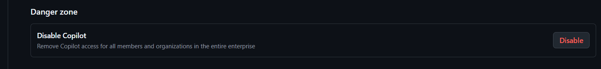

# 섹션 5: GitHub Copilot Security FAQ

GitHub Copilot 도입 시 보안팀·컴플라이언스 담당자가 가장 자주 묻는 보안 질문에 대한 근거 기반 답변을 제공합니다.

데이터 처리 및 프라이버시, 보안 아키텍처, 지적 재산권, 컴플라이언스, 운영 보안까지 — 도입 검토 단계에서 필요한 **보안 대응 체크리스트**를 제공합니다.

---

## 5.1 데이터 처리 및 프라이버시

### Q1. Copilot은 우리 코드를 학습에 사용하나요?

**아니요.** GitHub Copilot Business 및 Enterprise 플랜에서는 고객 코드가 AI 모델 학습(Training)에 사용되지 않습니다.

| 항목 | Copilot Individual | Copilot Business/Enterprise |
|------|--------------------|-----------------------------|
| 코드 학습 사용 | 옵트인/옵트아웃 선택 | ❌ 사용하지 않음 |
| 프롬프트 보존 | 설정에 따라 다름 | ❌ 보존하지 않음 |
| 제안 보존 | 설정에 따라 다름 | ❌ 보존하지 않음 |

### Q2. 프롬프트와 제안 데이터는 어떻게 처리되나요?

- **전송**: TLS 1.2+ 암호화를 통해 GitHub 서버로 전송
- **처리**: 실시간으로 제안 생성 후 즉시 폐기
- **저장**: Business/Enterprise 플랜에서는 프롬프트와 제안을 저장하지 않음
- **로그**: 사용량 메타데이터(타임스탬프, 언어, 수락/거부)만 로깅

### Q3. 데이터는 어디에서 처리되나요?

GitHub Copilot의 AI 추론은 Microsoft Azure 인프라에서 처리됩니다.

- Azure 데이터센터 위치: 미국, 유럽 등
- 데이터 상주(Data Residency): 현재 특정 리전 선택은 불가하나, GitHub은 지속적으로 옵션 확대 중
- EU 데이터 보호: GitHub은 EU 표준계약조항(SCC)을 통해 GDPR 준수

### Q4. 다른 고객의 코드가 우리에게 제안될 수 있나요?

Copilot은 공개 코드로 학습된 모델을 사용하므로, 공개 코드와 유사한 제안이 나올 수 있습니다. 이를 방지하기 위해:

- **Suggestions matching public code** 정책을 `Blocked`로 설정하면, 공개 코드와 ~150자 이상 일치하는 제안을 차단합니다
- 다른 Business/Enterprise 고객의 비공개 코드는 절대 제안에 포함되지 않습니다

---

## 5.2 보안 아키텍처

### Q5. Copilot의 보안 아키텍처는 어떻게 구성되어 있나요?

```
개발자 IDE
    │
    │ TLS 1.2+ 암호화
    ▼
GitHub Copilot Proxy (인증/인가)
    │
    │ 내부 암호화 통신
    ▼
Azure OpenAI Service (AI 추론)
    │
    │ 제안 생성 후 즉시 폐기
    ▼
개발자 IDE (제안 수신)
```

### Q6. 네트워크 요구 사항은 무엇인가요?

Copilot 사용을 위해 다음 엔드포인트에 대한 HTTPS(443) 아웃바운드 접근이 필요합니다:

| 엔드포인트 | 용도 |
|------------|------|
| `github.com` | 인증 및 라이선스 확인 |
| `api.github.com` | API 통신 |
| `*.githubcopilot.com` | Copilot 제안 서비스 |
| `copilot-proxy.githubusercontent.com` | Copilot 프록시 |
| `default.exp-tas.com` | 실험 프레임워크 (선택) |
| `copilot-telemetry.githubusercontent.com` | 텔레메트리 (선택) |

### Q7. 프록시/방화벽 환경에서도 사용 가능한가요?

- HTTP/HTTPS 프록시 지원 (IDE 프록시 설정 활용)
- SSL Inspection(MITM) 환경에서는 인증서 신뢰 설정 필요
- GitHub Enterprise Cloud with Data Residency를 통해 네트워크 제어 강화 가능

### Q8. Copilot은 우리 코드베이스 전체에 접근하나요?

**아니요.** Copilot은 현재 IDE에서 열려 있는 파일과 관련 컨텍스트만 사용합니다:

- 현재 편집 중인 파일
- IDE에서 열려 있는 탭의 파일들
- 프로젝트 내 관련 파일 (언어 서버 기반)
- Content Exclusion 설정으로 특정 파일/폴더 제외 가능

### Q9. 저장 데이터 암호화(Encryption at Rest)는 어떻게 되어 있나요?

GitHub 인프라에 저장되는 모든 데이터는 **AES-256 이상**의 암호화가 적용됩니다.

- GitHub Trust Center를 통해 암호화 정책 확인 가능
- Business/Enterprise 플랜에서는 프롬프트/제안이 저장되지 않으므로 암호화 대상 데이터 자체가 최소화됨
- 계약 시 구체적인 암호화 사양 확인이 필요한 경우 별도 요청 가능

### Q10. 프롬프트 인젝션(Prompt Injection) 공격에 대한 보호가 있나요?

**예.** GitHub Copilot은 다층 방어 체계를 통해 프롬프트 인젝션을 방지합니다:

- 숨겨진 문자(hidden character) 필터링
- Agent Mode에서의 안전장치(Safeguarding) 적용
- GitHub Copilot Proxy 엔드포인트의 보안 레이어
- OWASP 7계층 프롬프트 인젝션 방어 프레임워크에 부합하는 보호 체계

> 참고: [Cloud agent risks and mitigations](https://docs.github.com/en/copilot/concepts/agents/cloud-agent/risks-and-mitigations), [Safeguarding against Prompt Injection](https://github.blog/security/vulnerability-research/safeguarding-vs-code-against-prompt-injections/)

### Q11. 입력 검증 및 사용량 제한(Rate Limiting)은 어떻게 적용되나요?

GitHub Copilot은 서비스 안정성과 보안을 위해 입력 크기 제한 및 요청 제한을 적용합니다:

- 프롬프트/컨텍스트 크기에 대한 서비스 제한 존재
- 클라우드 서비스 할당량(quota) 및 속도 제한(rate limit) 적용
- 사용량 기반 과금 도구에 대한 요청 제한으로 비용 통제 가능

> 참고: [Copilot usage limits](https://docs.github.com/en/copilot/concepts/usage-limits)

### Q12. AI 출력에 대한 비정상 감지 및 콘텐츠 필터링이 적용되나요?

**예.** GitHub Copilot Proxy에서 콘텐츠 필터링이 수행됩니다:

- 유해하거나 부적절한 콘텐츠 필터링
- 비정상 출력(Odd Output) 감지 로직이 모델 코어와 논리적으로 분리되어 작동
- Enterprise 환경에서는 조직 정책에 따라 콘텐츠 필터 구성 가능

---

## 5.3 지적 재산권 (IP) 및 라이선스

### Q13. Copilot이 생성한 코드의 소유권은 누구에게 있나요?

- Copilot이 생성한 코드의 **지적 재산권은 사용자(고객)에게** 귀속됩니다
- GitHub은 Copilot 출력물에 대한 소유권을 주장하지 않습니다

### Q14. IP Indemnity(지적재산권 면책)란 무엇인가요?

GitHub Copilot Business/Enterprise 플랜에는 **IP Indemnity**가 포함됩니다:

- GitHub이 Copilot 제안으로 인한 제3자 IP 침해 클레임에 대해 고객을 방어합니다
- 적용 조건:
  - Copilot이 생성한 코드를 그대로 사용할 것
  - Suggestions matching public code 필터가 활성화되어 있을 것
  - 의도적으로 침해 코드를 생성하지 않을 것

### Q15. 오픈소스 라이선스 위반 위험은 없나요?

- **Public code filter** 활성화 시, 공개 저장소 코드와 높은 유사도를 보이는 제안을 차단
- 제안된 코드에 라이선스 헤더가 포함된 경우 표시
- 조직 차원에서 SBOM(Software Bill of Materials) 도구와 병행 사용 권장

---

## 5.4 컴플라이언스

### Q16. GitHub Copilot은 어떤 보안 인증을 보유하고 있나요?

| 인증/표준 | 상태 |
|-----------|------|
| SOC 2 Type II | ✅ 인증 완료 |
| ISO 27001 | ✅ 인증 완료 |
| ISO 42001 (AI 관리체계) | ✅ 인증 확대 중 |
| FedRAMP | 🔄 진행 중 (GitHub Enterprise) |
| CSA STAR | ✅ 인증 완료 |

> ISO/IEC 42001:2023은 AI 관리체계에 대한 국제 표준으로, GitHub은 Copilot 포트폴리오 전반에 대해 인증을 확대하고 있습니다. 정식 벤더 승인 시 현재 인증서, 인증 범위, 대상 서비스 및 인증기관 증빙을 GitHub에 요청하세요.
>
> 참고: [GitHub Copilot Trust Center](https://copilot.github.trust.page/)

### Q17. GDPR 준수는 어떻게 보장되나요?

- GitHub은 **데이터 처리자(Data Processor)** 역할
- EU 표준계약조항(Standard Contractual Clauses) 적용
- 데이터 처리 계약(DPA) 제공
- 개인정보 처리 최소화: 코드 제안에 개인정보가 포함되지 않도록 필터링

### Q18. HIPAA 환경에서 사용 가능한가요?

- GitHub Enterprise Cloud는 BAA(Business Associate Agreement) 체결 가능
- 단, PHI(Protected Health Information)가 포함된 코드에 대해서는 Content Exclusion 설정 필수
- HIPAA 대상 코드에 대해서는 추가 보안 검토 권장

### Q19. 금융권(PCI DSS) 환경에서의 고려사항은?

- 카드 데이터가 포함된 코드 파일은 Content Exclusion으로 제외
- Copilot 사용 이력은 Audit Log를 통해 추적 가능
- 기존 코드 리뷰 프로세스와 병행하여 보안 검증

---

## 5.5 운영 보안

### Q20. Copilot 사용에 대한 감사 추적(Audit Trail)이 가능한가요?

**예.** GitHub Enterprise Audit Log를 통해 다음을 추적할 수 있습니다:

- Copilot 시트 할당/해제 이력
- Copilot 정책 변경 이력
- Content Exclusion 규칙 변경
- 사용자별 활성/비활성 상태

### Q21. Copilot이 보안 취약점이 있는 코드를 제안할 수 있나요?

- AI 생성 코드도 사람이 작성한 코드와 동일한 리뷰 프로세스를 거쳐야 합니다
- GitHub Advanced Security(CodeQL, Secret Scanning, Dependabot)와 함께 사용 권장
- Copilot Chat에서 보안 관련 질문 시 보안 모범 사례를 안내합니다

### Q22. Secret(비밀 정보)이 Copilot을 통해 유출될 수 있나요?

- Copilot은 코드에 하드코딩된 시크릿을 제안하지 않도록 필터링
- 추가 보호를 위해 **GitHub Secret Scanning**과 Push Protection 활성화 권장
- Content Exclusion으로 환경 설정 파일(.env 등) 제외 설정 가능

### Q23. Copilot을 비활성화하거나 접근을 제한할 수 있나요?

**예.** 다양한 수준에서 제어 가능합니다:

| 수준 | 제어 방법 |
|------|-----------|
| Enterprise | 전체 정책으로 활성화/비활성화 |
| Organization | Organization 정책으로 제어 |
| 팀/개인 | 시트 할당/해제로 접근 관리 |
| 저장소/파일 | Content Exclusion 규칙으로 특정 컨텐츠 제외 |

보안 사고의 우려가 있는 경우, 즉각적으로 대응 가능한 엔터프라이즈 레벨의 Kill Switch 를 확인할 수도 있습니다.



GitHub Enterprise Settings 에서 해당 메뉴를 확인하실 수 있습니다.

### Q24. MFA/SSO 인증을 필수로 적용할 수 있나요?

**예.** Enterprise 환경에서는 MFA 또는 SSO 를 필수 구성으로 적용할 수 있습니다:

- GitHub은 2FA(Two-Factor Authentication)를 지원하며, 조직 차원에서 필수화 가능
- Enterprise Cloud에서는 SAML SSO를 통한 중앙 집중식 인증 관리 가능
- Copilot 접근은 GitHub 계정 인증에 의존하므로, MFA/SSO 적용 시 Copilot 접근도 동일하게 보호됨

> 참고: [Enterprise SAML SSO](https://docs.github.com/en/enterprise-cloud@latest/organizations/managing-saml-single-sign-on-for-your-organization)

### Q25. 확장 프로그램(Extension) 및 에이전트 접근은 어떻게 제한하나요?

Enterprise 정책을 통해 확장 프로그램과 에이전트 기능을 제어할 수 있습니다:

- 필요하지 않은 Extension 및 Agent 기능은 정책적으로 비활성화 가능
- Cloud Agent의 도구 선택, 자격 증명, 브랜치 범위 및 워크플로우 실행이 제한됨
- IDE 확장(MCP 등)은 별도로 검토하여 최소 권한 원칙 적용 권장

> 참고: [Managing Copilot policies](https://docs.github.com/en/copilot/concepts/policies)

### Q26. 인시던트 발생 시 대응 절차는?

GitHub Copilot 의 경우 보안 사고 방지를 위한 다양한 계층을 제공합니다. 해당 기능을 숙지하신 뒤 Runbook 을 만들어 Production 환경에서 대응책을 설계하시기를 권장드립니다.

1. **즉시 대응**: Enterprise 설정에서 Copilot 전체 비활성화 가능 (Q23 항목 참고)
2. **조사**: Audit Log를 통해 이벤트 추적
3. **보고**: GitHub 지원팀에 보안 인시던트 리포트
4. **복구**: Content Exclusion 규칙 추가 후 서비스 재개

---

## 5.6 AI 에이전트 보안

### Q27. AI 에이전트(Coding Agent)의 고위험 작업에 대한 Human-in-the-loop이 보장되나요?

**예.** GitHub Copilot의 Cloud Agent는 자율적으로 코드를 병합하거나 승인할 수 없습니다:

- Cloud Agent는 **Draft Pull Request만 생성** 가능하며, 직접 승인(approve)하거나 병합(merge)할 수 없음
- 워크플로우 실행 시 기본적으로 사람의 승인(Human Approval)이 필요
- 브랜치 보호 규칙을 통해 추가적인 리뷰 요구 설정 가능

> 참고: [Cloud agent risks and mitigations](https://docs.github.com/en/copilot/concepts/agents/cloud-agent/risks-and-mitigations)

### Q28. AI 에이전트는 고유 식별자(Identity)를 가지고 있나요?

**예.** Agent가 작성한 커밋과 활동은 명확하게 식별됩니다:

- Agent가 생성한 커밋은 Copilot에 귀속(attributable)되며, 세션 로그와 연결됨
- Enterprise 관리자는 Agent 활동을 Audit Log에서 별도로 추적 가능
- 사람의 작업과 Agent의 작업이 명확하게 구분됨

> 참고: [Agent management for enterprises](https://docs.github.com/en/copilot/concepts/agents/enterprise-management)

### Q29. AI 에이전트의 실행 환경은 격리되어 있나요?

**예.** Cloud Agent는 제한된 격리 환경에서 실행됩니다:

- 인터넷 접근이 제한된 격리 환경에서 작업 수행
- 저장소 자격 증명(credential)이 제한적으로 부여됨
- 기본 브랜치(default branch)에 대한 직접 push 차단
- Enterprise 정책으로 허용할 도구 및 워크플로우를 화이트리스트 방식으로 관리

> 참고: [Building cloud-agent guardrails](https://docs.github.com/en/copilot/tutorials/cloud-agent/build-guardrails)

### Q30. AI 에이전트 간 권한 상승(Privilege Escalation)은 방지되나요?

**예.** GitHub은 에이전트 체인을 통한 권한 상승을 다계층으로 방지합니다:

- 에이전트별로 범위가 지정된 도구(scoped tools) 할당
- 격리된 서브 에이전트 컨텍스트
- 제한된 자격 증명 및 브랜치 접근
- 기본 브랜치 직접 작업 및 병합 차단
- 워크플로우 승인 및 필수 사람 리뷰

> 참고: [Agentic security principles](https://github.blog/ai-and-ml/github-copilot/how-githubs-agentic-security-principles-make-our-ai-agents-as-secure-as-possible/)

---

## 5.7 보안 도입 체크리스트

### 도입 전 체크리스트

**벤더 평가 및 계약**

- [ ] 보안팀 검토 및 승인 완료
- [ ] 데이터 처리 계약(DPA) 검토 및 서명
- [ ] SOC 2 / ISO 27001 인증 보고서 확인 (GitHub Trust Center)
- [ ] ISO 42001 AI 관리체계 인증 범위 확인
- [ ] IP Indemnity 적용 조건 확인
- [ ] 데이터 상주(Data Residency) 요건 확인 및 구성

**네트워크 및 인프라**

- [ ] 네트워크 방화벽 규칙 설정 (필수 엔드포인트 허용)
- [ ] 프록시/SSL Inspection 환경 인증서 설정 확인
- [ ] 저장 데이터 암호화(AES-256) 정책 확인

**인증 및 접근 제어**

- [ ] MFA 또는 SAML SSO 필수 적용 확인
- [ ] Copilot 시트 할당 대상 범위 정의
- [ ] Content Exclusion 규칙 정의 (민감 코드/파일 제외)
- [ ] Public code filter 활성화 확인
- [ ] 불필요한 Extension/Agent 기능 비활성화 정책 수립

**AI 에이전트 보안 (Coding Agent 사용 시)**

- [ ] Cloud Agent 브랜치 보호 규칙 설정 (기본 브랜치 직접 push 차단)
- [ ] Agent 워크플로우 Human Approval 필수 설정 확인
- [ ] Agent 도구(tool) 화이트리스트 정책 구성
- [ ] Agent 자격 증명(credential) 최소 권한 부여 확인

### 운영 중 체크리스트

**모니터링 및 감사**

- [ ] Audit Log 모니터링 설정 (Agent 활동 포함)
- [ ] Audit Log 보존 기간(180일 기본) 확인 및 SIEM 연동
- [ ] GitHub Advanced Security 도구 활성화 (CodeQL, Secret Scanning, Dependabot)
- [ ] Agent 커밋 귀속(attribution) 및 세션 로그 추적 설정

**접근 및 정책 관리**

- [ ] 정기 접근 권한 리뷰 (시트 할당 현황)
- [ ] Extension/Agent 허용 목록 정기 점검
- [ ] 콘텐츠 필터링 및 프롬프트 인젝션 방어 정책 점검
- [ ] 사용량 제한(Rate Limit) 및 비용 모니터링

**인시던트 대응**

- [ ] 인시던트 대응 절차 문서화
- [ ] Copilot 긴급 비활성화 절차 테스트 완료
- [ ] 보안 정책 업데이트 주기 설정
- [ ] 서브프로세서(Subprocessor) 변경 알림 모니터링

---

## 참고 자료

- [GitHub Copilot Trust Center](https://resources.github.com/copilot-trust-center/)
- [GitHub Copilot 개인정보 처리방침](https://docs.github.com/en/site-policy/privacy-policies/github-general-privacy-statement)
- [GitHub Security](https://github.com/security)
- [GitHub Enterprise Cloud 보안 모범 사례](https://docs.github.com/en/enterprise-cloud@latest/admin/overview/best-practices-for-enterprises)
- [Content Exclusion 설정 가이드](https://docs.github.com/en/copilot/managing-copilot/managing-github-copilot-in-your-organization/configuring-content-exclusions-for-github-copilot)
- [GitHub Copilot Business 개인정보 보호](https://docs.github.com/en/copilot/responsible-use-of-github-copilot-features/github-copilot-business-privacy-statement)
- [Cloud Agent Risks and Mitigations](https://docs.github.com/en/copilot/concepts/agents/cloud-agent/risks-and-mitigations)
- [Building Cloud-Agent Guardrails](https://docs.github.com/en/copilot/tutorials/cloud-agent/build-guardrails)
- [Copilot Usage Limits](https://docs.github.com/en/copilot/concepts/usage-limits)
- [Managing Copilot Policies](https://docs.github.com/en/copilot/concepts/policies)
