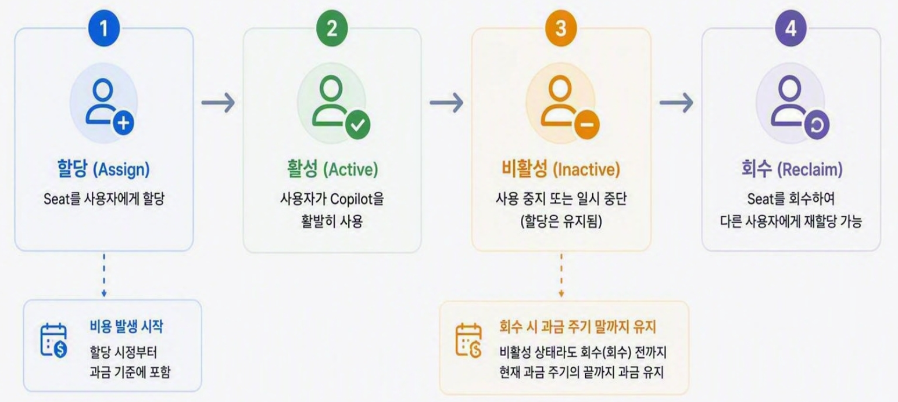
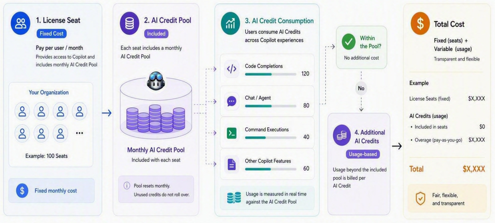
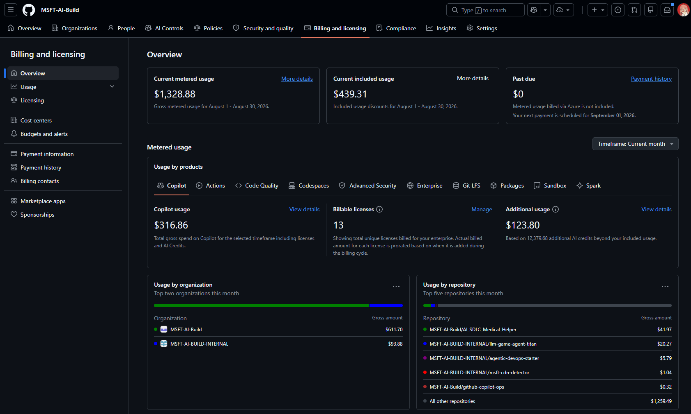
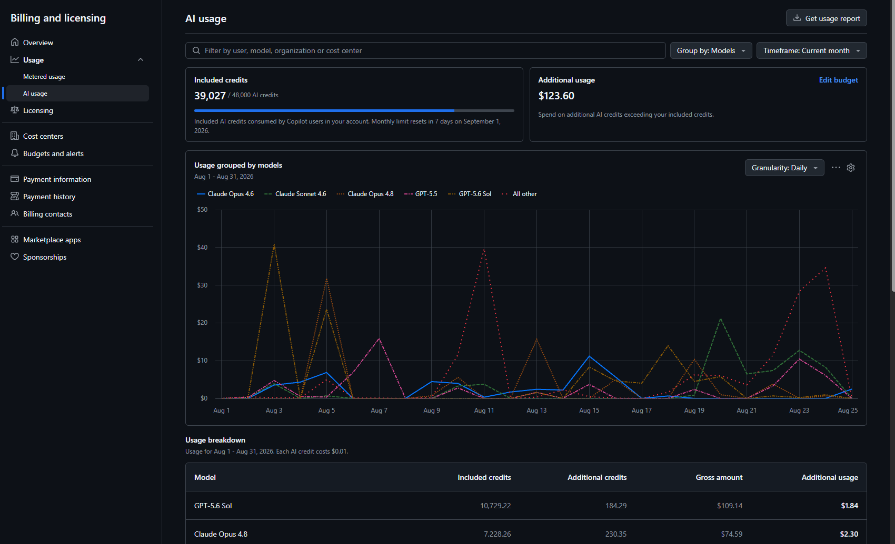
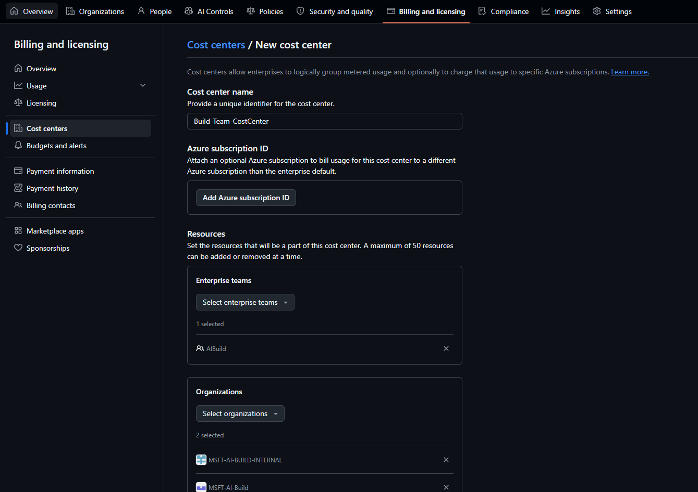
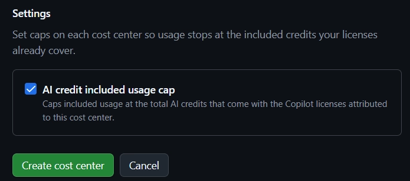
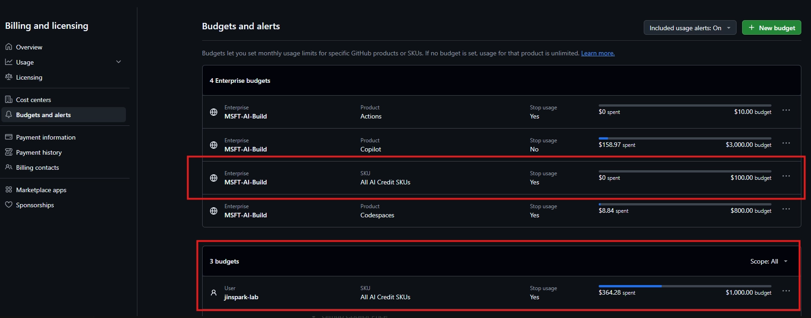

# 섹션 6: GitHub Copilot FinOps — 비용 관리

이 섹션에서는 GitHub Copilot의 비용 체계를 이해하고, 엔터프라이즈 환경에서 효과적으로 비용을 관리하기 위한 FinOps 전략을 다룹니다.

단순한 비용 절약 가이드가 아니라, 비용 구조를 파악한 뒤 조직별·사용자별로 체계적인 비용 관리 방안을 제시하는 것이 목표입니다.

---

## 6.1 Copilot 비용 구조 이해

GitHub Copilot의 비용은 크게 **고정비(License Seat)** 와 **변동비(AI Credits)** 두 축으로 구성됩니다. Usage-Based Billing이 본격 적용되면서, 단순 시트 수 관리를 넘어 실제 사용량까지 모니터링하는 비용 운영이 필수가 되었습니다.

---

### 6.1.1 License Seat (라이선스 시트) 개념

#### Seat이란?

**Seat = 1명의 사용자에게 부여하는 Copilot 접근 라이선스**입니다. Organization 또는 Enterprise 수준에서 할당하며, 시트가 할당된 사용자만 Copilot 기능을 사용할 수 있습니다.



#### Seat 할당 방식

| 할당 방식 | 설명 | 적합한 상황 |
|-----------|------|-------------|
| **개별 사용자 지정** | 관리자가 특정 사용자를 직접 할당 | 소규모 팀, 파일럿 |
| **팀(Team) 기반 할당** | GitHub Team 멤버십에 따라 자동 할당 | 부서/팀 단위 관리 |
| **SCIM 프로비저닝** | IdP(Identity Provider)와 연동하여 자동 할당/해제 | 대규모 엔터프라이즈 |
| **전체 Org 활성화** | Organization 전체 멤버에게 일괄 할당 | 전사 도입 |

#### Seat 관리 핵심 규칙

| 규칙 | 설명 |
|------|------|
| **Enterprise 중복 제거** | 동일 사용자가 Enterprise 내 여러 Org에서 시트를 받아도 **1회만 과금** |
| **상위 플랜 우선** | Business + Enterprise 시트를 동시에 받으면 Enterprise 요금만 부과 |
| **과금 주기 말 해제** | 시트 제거 시 즉시 접근 차단되나, 과금은 현재 청구 주기 종료까지 유지 |
| **개인 플랜 Override** | 조직 시트 할당 시 기존 개인 구독은 자동 취소 (비례 환불) |

#### Seat 할당 권한 체계

```
Enterprise Owner
├── Copilot 정책 설정 (활성화할 Org 선택)
├── Enterprise 전체 사용량 조회
└── 개별 시트 할당 불가 (Org에 위임)

Organization Owner / Admin
├── 개별 사용자 시트 할당/해제
├── 팀 기반 할당 설정
├── 사용량 리포트 조회
└── 비활성 시트 관리

Billing Manager
├── 비용 현황 조회
└── 시트 할당/해제 불가 (읽기 전용)
```

---

### 6.1.2 AI Credits와 Usage-Based Billing

#### AI Credits이란?

**AI Credit = GitHub Copilot의 프리미엄 기능 사용을 측정하는 과금 단위**

- **1 AI Credit = $0.01 USD**
- 토큰(Token) 소비량을 기반으로 크레딧이 차감됨
- 사용 모델(LLM)에 따라 동일 작업이라도 크레딧 소비량이 다름
- 매월 포함된 크레딧 한도를 초과하면 추가 과금 발생


> **✅ Note**: AI 특성상, Credit을 토큰 사용량으로 직접 환산하기는 어렵습니다. 토큰 사용량에 따라 비용이 발생하고, 그 비용만큼 AI Credit이 측정된 뒤 할인이 적용되는 구조로 이해하면 됩니다.


#### 과금 대상 vs 무료 기능

| 기능 | 과금 여부 | 설명 |
|------|-----------|------|
| **Code Completion (Inline)** | ❌ 무제한 무료 | 코드 자동 완성, 모든 유료 플랜에서 무제한 |
| **Next Edit Suggestions (NES)** | ❌ 무제한 무료 | 다음 편집 위치 제안 |
| **Copilot Chat (IDE)** | ✅ 크레딧 소비 | 모델 선택에 따라 소비량 차등 |
| **Copilot Chat (Web/Mobile)** | ✅ 크레딧 소비 | IDE와 동일 과금 체계 |
| **Agent Mode** | ✅ 크레딧 소비 | 모델에 따른 멀티스텝 추론 복잡도에 비례 |
| **Code Review (PR)** | ✅ 크레딧 소비 | PR 크기·복잡도에 비례 |
| **Copilot CLI** | ✅ 크레딧 소비 | 비교적 낮은 소비량 |
| **PR Summary** | ✅ 크레딧 소비 | PR 설명 자동 생성 |

#### 모델별 크레딧 소비 차이

AI Credits은 **사용한 LLM 모델의 토큰 단가**에 따라 결정됩니다. 같은 질문이라도 선택한 모델에 따라 비용이 크게 달라집니다.

해당 내용은 모델 가격 정책 변경에 영향을 받기 떄문에 홈페이지에서 확인을 권고드립니다.

[GitHub Copilot 모델 가격표](https://docs.github.com/en/enterprise-cloud@latest/copilot/reference/copilot-billing/models-and-pricing)

---

### 6.1.3 Usage-Based Billing 작동 방식

#### 과금 흐름



GitHub Copilot에는 License Seat(고정 비용)과 사용량에 비례하는 AI Credit(변동 비용)이 존재합니다. License Seat 비용은 AI Credit Pool에서 차감되므로, 실제 청구 금액은 AI Credit 사용량을 기준으로 산정됩니다.

#### Pooled Credits (크레딧 풀링)

조직 내 크레딧은 **풀(Pool)** 로 운영됩니다. 개별 사용자가 아닌 조직 단위로 크레딧 총량이 관리됩니다.

```
Organization: 50명 × 1,900 크레딧 = 95,000 크레딧/월 (Pool)

사용자 A: 3,500 크레딧 사용 (초과 사용)
사용자 B: 500 크레딧 사용 (절약)
사용자 C: 1,200 크레딧 사용 (절약)
...
─────────────────────────────────────
Pool 잔여: 풀 총량 - 전체 사용량

→ 개별 사용자 한도 초과보다 Org Pool 총량 초과 여부가 과금 기준
```

## 6.2 GitHub Copilot 비용 관리하기



Enterprise > Billing and Licensing 메뉴를 통해 엔터프라이즈 수준의 비용 지출을 통합 관리할 수 있습니다.

GitHub Copilot뿐 아니라 GitHub의 다른 제품(Product)에 대한 사용량도 확인할 수 있으며, GitHub Copilot의 AI 사용량만 집중적으로 추적하는 것도 가능합니다.

### 6.2.1 AI Credit 사용량 확인하기



AI Usage 탭에서 모델별 사용량에 대한 상세 뷰(Detailed View)를 확인할 수 있습니다.
일자별로 어떤 모델이 가장 많이 사용되었는지, Included AI Credit Pool의 현재 소진 현황 등을 파악할 수 있습니다.

### 6.2.2 Cost Center와 Budget 할당하기



GitHub Copilot 비용을 관리하는 가장 효과적인 방법 중 하나는 **Cost Center**를 활용하는 것입니다.

Cost Center를 활용하면 Organization, Repository, Team, User 단위로 비용 관리를 세분화할 수 있고, 서로 다른 Azure Subscription에서 비용을 지불하도록 분리할 수도 있습니다.



AI Credit Cap을 설정하면, Cost Center 단위로 AI Credit 사용량 한도를 지정할 수 있습니다.

이를 통해 특정 Cost Center가 전사 AI Credit Pool을 과도하게 점유하는 것을 방지할 수 있습니다.



Budget을 설정하면 Enterprise / Cost Center / User 수준별로 예산을 관리할 수 있습니다.

예산 초과 시 해당 범위의 사용이 제한되므로, 보다 세밀한 비용 통제가 가능합니다.

| 구분 | Enterprise Level Budget | Cost Center Budget | User Level Budget |
|------|------------------------|--------------------|-------------------|
| **적용 범위** | Enterprise 전체 | Cost Center 단위 (Org, Repo, Team 등) | 개별 사용자 |
| **설정 주체** | Enterprise Owner / Billing Manager | Enterprise Owner / Billing Manager | Enterprise Owner / Billing Manager |
| **제어 단위** | Enterprise 내 모든 Org의 총 사용량 | 특정 Cost Center에 속한 리소스의 사용량 | 특정 사용자 1인의 사용량 |
| **주요 목적** | 전사 비용 상한선 관리 | 부서/팀/프로젝트별 비용 분배 및 과점유 방지 | 헤비 유저 제어 및 공정한 사용량 분배 |
| **Budget 초과 시** | Enterprise 전체 AI Credit 사용 차단 | 해당 Cost Center만 사용 차단 | 해당 사용자만 사용 차단 |
| **적합한 시나리오** | 전사 월간/연간 예산 총액 관리 | 사업부·팀별 예산 할당 및 독립 정산 | Coding Agent 등 고사용량 사용자 관리 |
| **세분화 수준** | 🔴 낮음 (전체 단위) | 🟡 중간 (그룹 단위) | 💚 높음 (개인 단위) |
| **권장 조합** | 전사 상한선으로 설정 | Cost Center별 비율 배분 | 헤비 유저 대상 선별 적용 |

Coding Agent의 경우 소수의 헤비 유저가 대부분의 토큰을 소비하는 특성이 있어, 세밀한 비용 제어가 사용량 최적화의 핵심 요소가 됩니다.

**권장 도입 순서:**

1. **Enterprise Level Budget**으로 전사 비용 가이드라인을 수립합니다.
2. **Cost Center별 예산**을 할당하여 부서·팀 단위로 운영합니다.
3. 1~2개월간 사용량을 분석한 뒤, **User Level Budget**을 적용하여 비용 관리 체계를 세분화합니다.


---

## 6.3 FinOps 체크리스트

### Phase 1: 현황 파악

- [ ] 현재 Copilot 시트 수 및 플랜(Business / Enterprise) 확인
- [ ] 월간 AI Credit 포함량(Included Credits)과 실제 사용량 비교
- [ ] 팀·부서별 시트 분포 및 사용량 편차 파악
- [ ] 비활성 시트 식별 (30일/60일/90일 미사용 기준)
- [ ] 모델별 크레딧 소비 비율 분석 (AI Usage 탭 활용)

### Phase 2: 비용 체계 구성

- [ ] Cost Center 설계 (Org / Team / Repository 단위)
- [ ] Cost Center별 AI Credit Cap 설정
- [ ] Enterprise Level Budget으로 전사 비용 상한선 설정
- [ ] Cost Center Budget으로 부서·팀별 예산 배분
- [ ] 헤비 유저 대상 User Level Budget 선별 적용
- [ ] 초과 사용(Overage) 정책 결정 (차단 vs 허용 후 추가 과금)

### Phase 3: 사용량 최적화

- [ ] 비활성 시트 회수 프로세스 수립 및 자동화
- [ ] 모델 사용 정책 수립 (비용 효율적 모델 우선 사용 가이드)
- [ ] Coding Agent 등 고사용량 기능에 대한 사용 가이드라인 배포
- [ ] SCIM 프로비저닝 연동으로 시트 할당/해제 자동화

### Phase 4: 모니터링 및 리포팅

- [ ] Copilot Metrics API를 활용한 사용량 데이터 수집 체계 구축
- [ ] Copilot Impact 대시보드 모니터링 설정
- [ ] 월간 비용 리포트 자동화 (Cost Center별 사용량·예산 소진율 포함)
- [ ] 분기별 FinOps 리뷰 회의 설정 (예산 재배분, 정책 조정)

---

## 참고 자료

- [GitHub Copilot 가격 정책](https://docs.github.com/en/copilot/about-github-copilot/subscription-plans-for-github-copilot)
- [Copilot Billing API](https://docs.github.com/en/rest/copilot/copilot-billing)
- [Copilot 시트 관리 API](https://docs.github.com/en/rest/copilot/copilot-user-management)
- [GitHub Enterprise 비용 관리](https://docs.github.com/en/enterprise-cloud@latest/billing/managing-your-github-billing-settings)
- [GitHub Copilot 사용량 리포트](https://docs.github.com/en/enterprise-cloud@latest/copilot/managing-copilot/managing-github-copilot-in-your-organization/reviewing-usage-data-for-github-copilot-in-your-organization)
- [FinOps Foundation](https://www.finops.org/)
