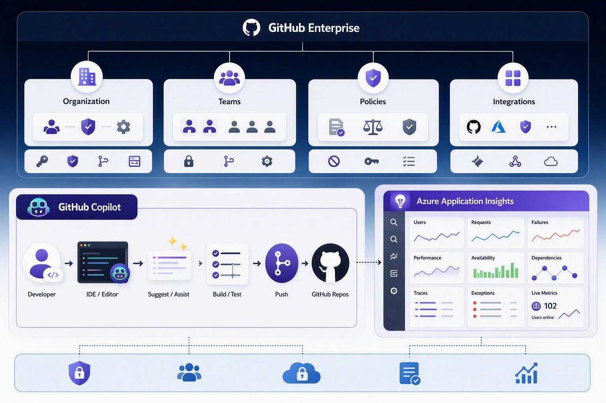

# GitHub Copilot Ops Workshop

> GitHub Copilot 기반 엔터프라이즈 운영 워크샵 — 구성부터 거버넌스, 관측 가능성, 보안, 비용 관리까지 가이드하는 운영자를 위한 워크샵입니다.

---

## 소개

GitHub Copilot은 모두를 위한 AI Coding Assistant입니다. 단독으로도 훌륭한 코딩 에이전트이지만, GitHub Enterprise 내에서 코드 기반의 에이전트 생태계를 함께 운영한다면 **엔터프라이즈 규모의 에이전트 플랫폼**으로서의 장점을 극대화할 수 있습니다.

그러나 엔터프라이즈 환경에서 AI 코딩 도구를 대규모로 도입하려면 단순히 "사용 시작"만으로는 부족합니다. **조직 구조 설계, 라이선스 관리, 거버넌스 정책 수립, 보안 검증, 사용량 모니터링, 비용 최적화**까지 — 운영 전반에 걸친 체계적인 접근이 필요합니다.

본 워크샵은 **GitHub Copilot을 엔터프라이즈 환경에서 안전하고 효과적으로 운영**하기 위한 실무 중심 가이드입니다. GitHub Copilot의 도입 계획 수립부터 GitHub Enterprise 기반의 거버넌스 체계 구성, 관측 가능성 확보, 보안 운영, 비용 관리까지 **엔터프라이즈 Copilot 운영의 전체 라이프사이클**을 다룹니다.

### 💡 이 워크샵을 통해 얻을 수 있는 것

- ✅ GitHub Enterprise Cloud 환경에서 Copilot을 **체계적으로 구성**하는 방법
- ✅ 조직 규모에 맞는 **라이선스 할당 전략**과 주요 기능 활용법
- ✅ Enterprise/Organization 수준의 **AI 거버넌스 정책** 설계 및 적용
- ✅ OpenTelemetry 기반 **관측 가능성 파이프라인** 구축과 대시보드 운영
- ✅ 보안팀·컴플라이언스 담당자를 위한 **보안 FAQ 및 대응 체크리스트**
- ✅ Copilot 운영 비용을 최적화하는 **FinOps 전략과 자동화 방안**

---

## 대상

| 역할 | 관련 섹션 | 주요 관심사 |
|------|-----------|------------|
| GitHub Enterprise 관리자 | 섹션 1, 3, 6 | 조직 구성, 정책 관리, 비용 최적화 |
| 플랫폼 엔지니어 / DevOps | 섹션 1, 4, 6 | 인프라 구성, 모니터링 파이프라인, 자동화 |
| 개발자 (Copilot 사용자) | 섹션 2 | Copilot 설치, 기능 활용, 프롬프트 엔지니어링 |
| 보안 / 컴플라이언스 담당자 | 섹션 3, 5 | 보안 아키텍처, 데이터 처리, 규정 준수 |
| 엔지니어링 매니저 | 섹션 1, 3, 4, 6 | 팀 생산성 측정, 거버넌스, ROI 분석 |
| CTO / IT 리더십 | 섹션 1, 5, 6 | 도입 전략, 보안 검증, 비용 계획 |

---

## 워크샵 리소스 소개

| 항목 | 설명 |
|------|------|
| **GitHub Enterprise Cloud** | Enterprise Account가 생성되어 있어야 합니다 |
| **GitHub Copilot 라이선스** | Copilot Business 또는 Enterprise 플랜 구독 |
| **IDE** | VS Code, JetBrains IDE, 또는 Neovim 중 하나 설치 |
| **관리자 권한** | Enterprise Owner 또는 Organization Owner 역할 (관리 실습 시) |
| **Azure 구독** *(선택)* | 섹션 4 Observability 실습에 필요 (Application Insights) |

---

## 워크샵 구성

| # | 섹션 | 설명 | 난이도 |
|---|------|------|--------|
| 1 | [GitHub Enterprise 구성](./01-enterprise-setup/) | Enterprise Cloud 계층 구조(Enterprise → Organization → Team) 이해, SAML SSO·SCIM 프로비저닝 설정, Enterprise 수준 정책 관리 및 Audit Log 스트리밍 구성 | ⭐⭐ |
| 2 | [GitHub Copilot 시작하기](./02-copilot-getting-started/) | Copilot 라이선스 모델(Business/Enterprise) 비교, 시트 할당 전략 수립, IDE별 App 설치 가이드, Code Completion·Chat·Agent Mode 등 핵심 기능 체험 | ⭐ |
| 3 | [AI 거버넌스](./03-ai-governance/) | Enterprise/Organization 수준 정책 계층 설계, Content Exclusion 규칙 구성, IP Indemnity 조건 검토, Copilot 기능별 활성화·비활성화 정책 관리 | ⭐⭐⭐ |
| 4 | [Observability](./04-observability/) | Copilot Metrics API를 활용한 사용량 데이터 수집, OpenTelemetry Collector 구성, Azure Application Insights 연동 및 실시간 대시보드 구축 | ⭐⭐⭐ |
| 5 | [Security FAQ](./05-security-faq/) | Copilot 보안 아키텍처 분석, 데이터 처리·프라이버시 정책, 네트워크 요구 사항, 지적 재산권·IP Indemnity, 규제 산업별 컴플라이언스 대응 가이드 | ⭐⭐ |
| 6 | [FinOps — 비용 관리](./06-finops/) | Copilot 라이선스 비용 구조 분석, 시트 사용률 모니터링, 비활성 시트 자동 회수 전략, 팀·부서별 비용 할당, ROI 측정 프레임워크 및 예산 계획 | ⭐⭐ |

> 💡 **권장 학습 순서**: 섹션 1 → 2 → 3 → 5 → 4 → 6 순으로 진행하면, 기본 구성을 마친 후 거버넌스와 보안을 이해하고 모니터링·비용 관리로 확장할 수 있습니다. 사용사례에 따라 Observability, Security 쪽 또는 FinOps 쪽만 확인하는 것도 가능합니다.

---

## 워크샵 상세 안내

### 📘 섹션 1 — GitHub Enterprise 구성

GitHub Copilot을 엔터프라이즈 규모로 운영하려면, 먼저 **GitHub Enterprise Cloud의 계층 구조**를 이해하고 올바르게 구성해야 합니다. Enterprise Account → Organization → Team으로 이어지는 관리 체계를 설계하고, SAML SSO와 SCIM을 통해 기존 IdP(Entra ID, Okta 등)와 연동합니다. Enterprise 수준의 정책 설정과 Audit Log 스트리밍을 구성하여 **중앙 집중식 관리 기반**을 마련합니다.

### 📗 섹션 2 — GitHub Copilot 시작하기

GitHub Copilot의 **라이선스 모델(Business vs Enterprise)**을 비교하고, 조직 규모와 요구 사항에 맞는 시트 할당 전략을 수립합니다. VS Code, JetBrains, Neovim 등 주요 IDE에 Copilot을 설치하고, Code Completion, Chat, Agent Mode 등 핵심 기능을 직접 체험합니다. 효과적인 **프롬프트 엔지니어링 기법**과 Custom Instructions를 활용한 팀 표준화 방법도 다룹니다.

### 📕 섹션 3 — AI 거버넌스

조직 내 AI 사용에 대한 **정책 체계(Policy Framework)**를 설계합니다. Enterprise → Organization으로 이어지는 정책 상속 구조를 이해하고, Content Exclusion 규칙으로 민감한 코드를 Copilot 컨텍스트에서 제외합니다. Copilot의 기능별(Code Completion, Chat, Agent, CLI 등) 활성화·비활성화 정책을 관리하고, **IP Indemnity 적용 조건**을 검토합니다.

### 📙 섹션 4 — Observability

**"측정할 수 없으면 관리할 수 없다"** — GitHub Copilot의 활용도를 정량적으로 파악하기 위한 관측 가능성 파이프라인을 구축합니다. Copilot Metrics API로 사용량 데이터를 수집하고, OpenTelemetry Collector를 거쳐 Azure Application Insights에 저장합니다. 실시간 대시보드를 통해 **팀별 활용률, 제안 수락률, 활성 사용자 추이**를 모니터링합니다.

### 📓 섹션 5 — Security FAQ

GitHub Copilot 도입 시 보안팀·컴플라이언스 담당자가 가장 자주 묻는 **20가지 보안 질문**에 대한 근거 기반 답변을 제공합니다. 데이터 처리 및 프라이버시, 보안 아키텍처, 지적 재산권, 컴플라이언스(SOC 2, ISO 27001, GDPR, HIPAA 등), 운영 보안까지 — 도입 검토 단계에서 필요한 **보안 대응 체크리스트**를 제공합니다.

### 📒 섹션 6 — FinOps (비용 관리)

GitHub Copilot의 **라이선스 비용을 체계적으로 관리**하기 위한 FinOps 전략을 다룹니다. 시트 사용률 분석, 비활성 시트 자동 회수, 팀·부서별 비용 할당, ROI 측정 프레임워크까지 — 단순한 비용 절감이 아닌, **투자 대비 가치를 극대화**하는 비용 운영 체계를 구축합니다.

---

## 라이센스

이 워크샵 자료는 [MIT License](LICENSE)로 제공됩니다.

## 참고 자료

- [GitHub Copilot 공식 문서](https://docs.github.com/en/copilot)
- [GitHub Enterprise Cloud 관리 가이드](https://docs.github.com/en/enterprise-cloud@latest/admin)
- [GitHub Copilot Trust Center](https://resources.github.com/copilot-trust-center/)
- [GitHub Copilot 비즈니스 사례 연구](https://github.com/customer-stories)
- [GitHub Blog — Copilot](https://github.blog/tag/github-copilot/)
